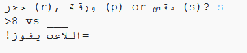

## المقدمة

في هذا المشروع ستصنع لعبة حجرة, ورقة, مقص, وتلعب ضد الكمبيوتر.

القواعد: أنت والكمبيوتر تختاران إما حجرة, ورقة, أو مقص. يتم اختيار الفائز حسب هذه القواعد:

* Rock blunts scissors
* الورقة تغطي الحجرة
* المقص يقص الورقة

  <iframe src="https://trinket.io/embed/python/e1e1d873be?outputOnly=true&start=result" width="600" height="500" frameborder="0" marginwidth="0" marginheight="0" allowfullscreen>
  </iframe>
  

### معلومات إضافية لقادة النادي

إذا كنت بحاجة إلى طباعة هذا المشروع، فيُرجى استخدام [النسخة القابلة للطباعة](https://projects.raspberrypi.org/en/projects/rock-paper-scissors/print).

## \--- collapse \---

## title: ملاحظات قادة النادي

## مقدمة:

في هذا المشروع سيتعلم الأطقال كيفية صنع برنامج يلعب لعبة "حجرة, ورقة, مقص" باستخدام المتغيرات و العبارات الشرطية.

## الموارد المتوفرة على الإنترنت

** يستخدم هذا المشروع Python 3. ** نوصي باستخدام [trinket](https://trinket.io/) لكتابة Python على الانترنت. يحتوي هذا المشروع على Trinket التالية:

* [‘Rock, Paper, Scissors’ Resources -- jumpto.cc/rps-go](http://jumpto.cc/rps-go)

وهناك أيضًا trinket تحتوي على المشروع المكتمل:

* [‘Rock, Paper, Scissors’ Finished -- trinket.io/python/e1e1d873be](https://trinket.io/python/e1e1d873be)

## الموارد المتوفرة دون اتصال بالإنترنت

يمكن أن يكون هذا المشروع [مكتمل دون اتصال بالإنترنت](https://www.codeclubprojects.org/en-GB/resources/python-working-offline/) إذا كنت تفضل ذلك. يمكنك الوصول إلى مصادر المشروع من خلال النقر على رابط "مواد المشروع" الخاص بهذا المشروع. يحتوي هذا الرابط على قسم "موارد المشروع" ، والذي يتضمن الموارد التي يحتاجها الأطفال لإكمال هذا المشروع دون الحاجة للإتصال باﻷنترنيت. تأكد من أن كل طفل لديه إمكانية للحصول على نسخة من هذه الموارد. يتضمن هذا القسم الملفات التالية:

* rock-paper-scissors/rock-paper-scissors.py

يمكنك أيضًا العثور على نسخة كاملة من هذا المشروع في قسم "موارد المتطوعين"، الذي يحتوي على:

* rock-paper-scissors-finished/rock-paper-scissors.py

(جميع الموارد المذكورة أعلاه قابلة للتنزيل أيضًا كملفات `.zip` للمشاريع والمتطوعين)

## أهداف التعلم

* المتغيرات؛
* Selection (`if`, `elif`, `else`); 
* Boolean `==` and `and`.

يتناول هذا المشروع عناصر من الصفوف التالية من [Raspberry Pi Digital Making Curriculum](http://rpf.io/curriculum):

* [استخدم أدوات البرمجة الأساسية لإنشاء برامج بسيطة.](https://www.raspberrypi.org/curriculum/programming/creator)

## التحديات

* "ASCII art" - Use conditional logic to display ASCII art for rock, paper and scissors. 
* "Create a new game" - Duplicate the Rock, Paper, Scissors game and remix it to create a new game. 

\--- /collapse \---

## \--- collapse \---

## مواد المشروع

## موارد المشروع

* [ملف.zip يحتوي على كل موارد المشروع](resources/rock-paper-scissors-project-resources.zip)
* [Online Trinket containing all 'Rock, Paper, Scissors' project resources](http://jumpto.cc/rps-go)
* [rock-paper-scissors/rock-paper-scissors.py](resources/rock-paper-scissors-rock-paper-scissors.py)

## موارد قادة النادي

* [ملف.zip يحتوي على جميع موارد المشروع المكتملة](resources/rock-paper-scissors-volunteer-resources.zip)
* [مشروع Trinket المكتمل على الإنترنت](https://trinket.io/python/e1e1d873be)
* [rock-paper-scissors-finished/rock-paper-scissors.py](resources/rock-paper-scissors-finished-rock-paper-scissors.py)

\--- collapse \---