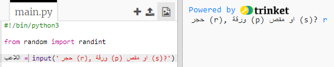

## دور اللاعب

أولًا، لندَع اللاعب يختار صخرة (Rock) أو ورقة (Paper) أو مقصًا (Scissors). 

+ افتح مشروع trinket هذا: <a href="http://jumpto.cc/rps-go" target="_blank">jumpto.cc/rps-go</a>. 

+ يحتوي المشروع بالفعل على التعليمة البرمجية لاستيراد دالة ستستخدمها في هذا المشروع. 

  
  
  ستستخدم الدالة `randint` لاحقًا لإنشاء أرقام عشوائية.

+ أولًا، لنسمح للاعب باختيار صخرة (Rock) أو (Paper) أو (Scissors) بإدخال الحرف 'r' أو 'p' أو 's'. 

  
  
+ اطبع الآن اختيار اللاعب:

  
  
+ اختبر التعليمات البرمجية بالنقر على `Run`. انقر في نافذة الإخراج في trinket وأدخل اختيارك. 

