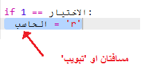

## دور الكمبيوتر

حان الآن دور الكمبيوتر. يمكنك استخدام الدالة `randint` لإنشاء رقم عشوائي للاختيار من بين الصخرة والورقة والمقص. 

  

+ استخدم الدالة `randint` لإنشاء رقم عشوائي لتحدِّد ما إذا كان الكمبيوتر قد اختار الصخرة أم الورقة أم المقص. 

  
  
+ شغِّل المقطع البرمجي مرات كثيرة (ستحتاج إلى إدخال 'r' أو 'p' أو 's' في كل مرة).
  
  سترى أن المتغير 'chosen' قد تم تعيينه عشوائيًا إلى 1 أو 2 أو 3. 
  
+ دعنا نفترض الآتي:
  
  + 1 = rock (r)
  + 2 = paper (p)
  + 3 = scissors (s)

  استخدم عبارة `if` لتتحقق مما إذا كان الرقم الذي تم اختياره عشوائيًا هو `1` (تُستخدم `==` لمعرفة ما إذا كان هناك شيئان متماثلان أم لا). 
  
  
  
+ يستخدم Python __المسافة البادئة__ (تحريك التعليمات البرمجية إلى اليمين) لتوضيح التعليمة البرمجية الموجودة داخل عبارة `if`. ويمكنك إدخال مسافتين (بالضغط على مفتاح المسافة مرتين) أو الضغط على __المفتاح tab__ (عادةً ما يكون أعلى المفتاح CAPSLOCK في لوحة المفاتيح).

  عيِّن `computer` إلى 'r' داخل عبارة `if` باستخدام المسافة البادئة:
  
  
  
+ يمكنك إضافة عبارة تحقق بديلة باستخدام `elif` (وهو اختصار _else if_):

  

  سيتم التحقق من هذا الشرط فقط إذا لم يتحقق الشرط الأول (أيْ إذا لم يختر الكمبيوتر الرقم `1`)
  
+ وأخيرًا، إذا لم يختر الكمبيوتر الرقم `1` أو الرقم `2`، فمن المؤكد أنه سيكون قد اختار الرقم `3`. 

  في هذه الحالة، يمكننا فقط استخدام `else` التي تعني (وإلا). 
  
  
  
+ والآن، بدلًا من طباعة الرقم العشوائي الذي اختاره الكمبيوتر، يمكنك طباعة الحرف. 

   
   
   يمكنك حذف السطر `print(chosen)` أو أن تأمر الكمبيوتر بتجاهله وذلك بوضع الرمز `#` في بداية السطر.
      
+ اختبر تعليماتك البرمجية بالنقر على Run وإدخال خيارك. 

+ يوجد خطأ، فاختيار الكمبيوتر تتم طباعته على سطر جديد. يمكنك إصلاح هذا الخطأ بإضافة `' '=end` بعد `vs`، فهذا يُخبر Python بإنهاء المقطع البرمجي بمسافة بدلًا من سطر جديد. 

   
      
+ العب اللعبة عدة مرات بالنقر على Run وإدخال خيار.

  إلى الآن، ستضطر إلى التحقق بنفسك لمعرفة الفائز. في الخطوة التالية، ستضيف تعليمات Python البرمجية التي ستقوم بعملية التحقق هذه.   
  

