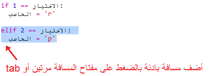

## دور الكمبيوتر

حان الآن دور الكمبيوتر. يمكنك استخدام دالة ` randint ` لإنشاء رقم عشوائي للاختيار من بين الصخرة والورقة والمقص.

+ استخدم ` randint ` لإنشاء رقم عشوائي لتحدِّد ما إذا كان الكمبيوتر قد اختار الصخرة أم الورقة أم المقص.
    
    

+ قم بتشغيل المقطع البرمجي مرات كثيرة عدة مرات (ستحتاج إلى إدخال 'r' أو 'p' أو 's' في كل مرة.)
    
    سترى أن المتغير 'chosen' قد تم تعيينه عشوائيًا إلى 1 أو 2 أو 3.

+ دعنا نفترض الآتي:
    
    + 1 = rock (r)
    + 2 = paper (p)
    + 3 = scissors (s)
    
    استخدم عبارة `if` لمعرفة ما إذا كان الرقم المختار هو `1` (تستخدم`==` لمعرفة ما إذا كان هناك شيئان متماثلان أم لا).
    
    

+ يستخدم Python المسافة البادئة **indentation** (تحريك التعليمات البرمجية إلى اليمين) لتوضيح التعليمة البرمجية الموجودة داخل عبارة `if`. ويمكنك إدخال مسافتين (بالضغط على مفتاح المسافة مرتين) أو الضغط على المفتاح **tab** (عادةً ما يكون أعلى المفتاح CAPSLOCK في لوحة المفاتيح)
    
    عيِّن `computer` إلى 'r' داخل عبارة `if` باستخدام المسافة البادئة:
    
    

+ يمكنك إضافة عبارة تحقق بديلة باستخدام `elif` (اختصار لـ *else if*):
    
    
    
    سيتم التحقق من هذا الشرط فقط إذا لم يتحقق الشرط الأول (أي إذا لم يختر الكمبيوتر الرقم `1`)

+ وأخيرًا ، إذا لم يختار الكمبيوتر الرقم `1` أو الرقم `2` فمن المؤكد أنه سيكون قد اختار الرقم `3`.
    
    في هذه الحالة, يمكننا فقط استخدام ` else` التي تعني وإلا.
    
    

+ والآن، بدلًا من طباعة الرقم العشوائي الذي اختاره الكمبيوتر، يمكنك طباعة الحرف.
    
    
    
    يمكنك حذف السطر `print(chosen)` أو أن تأمر الكمبيوتر بتجاهله وذلك بوضع الرمز `#` في بداية السطر.

+ اختبر تعليماتك البرمجية بالنقر على Run وإدخال خيارك.

+ يوجد خطأ، فاختيار الكمبيوتر تتم طباعته على سطر جديد. يمكنك إصلاح ذلك عن طريق إضافة ` end = '' ` بعد `vs` الذي يخبر Python بإنهاء المقطع البرمجي بمسافة بدلًا من سطر جديد.
    
    

+ العب اللعبة عدة مرات بالنقر على Run وإدخال خيار.
    
    إلى الآن، ستضطر إلى التحقق بنفسك لمعرفة الفائز. في الخطوة التالية، ستضيف تعليمات Python البرمجية التي ستقوم بعملية التحقق هذه.