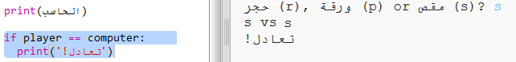
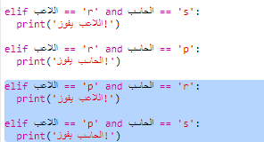
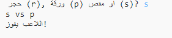

## التحقق من النتيجة

لنضِف الآن تعليمات برمجية لمعرفة الفائز.

+ ستحتاج إلى المقارنة بين متغيرات `player` و `computer` لمعرفة الفائز منهما.
    
    وإذا كان المتغيران متماثلين، فستنتهي اللعبة بالتعادل:
    
    

+ اختبر تعليماتك البرمجية بلعب اللعبة عدة مرات حتى تحصل على نتيجة تعادل.
    
    ستحتاج إلى النقر على `Run` لبدء لعبة جديدة.

+ لنلقِ الآن نظرة على الحالات التي يكون فيها الخيار 'r' (الصخرة) هو اختيار اللاعب لا الكمبيوتر.
    
    إذا اختار الكمبيوتر 's' (المقص)، فإن اللاعب يفوز (الصخرة تهزم المقص).
    
    وإذا اختار الكمبيوتر 'p' (الورقة)، فإن الكمبيوتر يفوز (الورقة تهزم الصخرة).
    
    يمكننا التحقق من اختيار اللاعب *و* اختيار الكمبيوتر باستخدام العامل `and`.
    
    

+ لنلقِ الآن نظرة على الحالات التي يكون فيها الخيار 'p' (الورقة) هو اختيار اللاعب لا الكمبيوتر:
    
    

+ وأخيرًا، هل يمكنك إضافة تعليمة برمجية للتحقق من الفائز عندما يختار اللاعب 's' (المقص) ويختار الكمبيوتر الصخرة أو الورقة؟

+ العب اللعبة الآن لتختبر التعليمة البرمجية.
    
    
    
    انقر على `Run` لتبدأ لعبة جديدة.