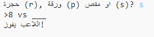
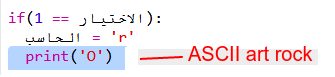
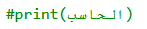
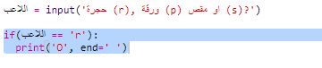

--- challenge ---

## التحدي: رسم ASCII

هل يمكنك استخدام رسم ASCII بدلًا من استخدام الأحرف r وp وs لتمثيل الحجر والورقة والمقص؟

مثال:

عندما:

    rock: O
    paper: ___
    scissors: >8
    

+ بدلا من قول `print computer` ستحتاج إلى إضافة سطر جديد لكل خيار في `if` لطباعة فن ASCII الصحيح. 

تلميحات:

+ بدلًا من استخدام `print player`، ستحتاج إلى إضافة عبارة if جديدة للتحقق من العنصر الذي اختاره اللاعب وطباعة رسم ASCII المناسب:

تلميح:

تذكر أن إضافة `end=' '` إلى نهاية `print` تجعل المقطع البرمجي ينتهي بمسافة بدلًا من سطر جديد.

--- /challenge ---