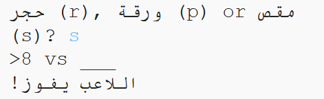

\--- challenge \---

## Challenge: ASCII Art

بدلا من استخدام الحروف r, p و s لتمثل حجرة, ورقة, ومقص, هل يمكنك استخدام فن ASCII؟

مثال:

Where:

    rock: O
    paper: ___
    scissors: >8
    

+ بدلا من قول `print computer` ستحتاج إلى إضافة سطر جديد لكل خيار في `if` لطباعة فن ASCII الصحيح. 

تلميح:

+ بدلا من قول: `print player` ستحتاج إلى إضافة عبارة جديدة للتأكد من أي مكون اختاره اللاعب وطباعة فن ASCII الصحيح:

Hint:

تذكر أن إضافة `end=' '` إلى نهاية `print` يجعلها تنتهي بمسافة بدلا من الانتهاء بسطر جديد.

\--- /challenge \---