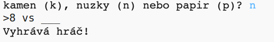

## Úvod

V tomto projektu vyrobíte hru "kámen, nůžky, papír" a zahrajete si ji proti počítači.

Pravidla: Vy i počítač vybíráte kámen, nůžky nebo papír. Vítěze určují pravidla:

* kámen tupí nůžky
* papír obalí kámen
* nůžky stříhají papír

  <iframe src="https://trinket.io/embed/python/1f0b19732f?outputOnly=true&start=result" width="600" height="500" frameborder="0" marginwidth="0" marginheight="0" allowfullscreen>
  </iframe>
  

### Další informace pro vedoucí klubů

Potřebujete-li tento projekt vytisknout, použijte [verzi pro tisk](https://projects.raspberrypi.org/cs-CZ/projects/rock-paper-scissors/print).

--- collapse ---
---
title: Poznámky vedoucího klubu
---

## Úvod:

V tomto projektu se děti naučí, jak s použitím proměnných a podmíněných příkazů vytvořit program, který hraje "kámen, nůžky, papír".

## Online zdroje

**Projekt používá Python 3.** Na psaní online v Pythonu doporučujeme používat [trinket](https://trinket.io/) . Projekt obsahuje následující trinkety:

* [Zdroje pro "kámen, nůžky, papír" – jumpto.cc/rps-go](http://jumpto.cc/rps-go)

K dispozici je také trinket obsahující dokončený projekt:

* [Dokončený 'kámen, nůžky, papír' - trinket.io/python/1f0b19732f](https://trinket.io/python/1f0b19732f)

## Offline zdroje

Pokud tomu dáváte přednost, můžete tento projekt [dokončit offline](https://www.codeclubprojects.org/en-GB/resources/python-working-offline/). Ke zdrojům projektu se dostanete kliknutím na odkaz "materiály pro projekt". Tento odkaz obsahuje sekci "zdroje projektu", se zdroji, které děti budou potřebovat k dokončení projektu offline. Ujistěte se, že každé dítě má přístup ke kopii těchto zdrojů. Tato sekce obsahuje následující soubory:

* rock-paper-scissors/rock-paper-scissors.py

V sekci "zdroje dobrovolníků" také můžete najít dokončenou verzi tohoto projektu, která obsahuje:

* rock-paper-scissors-finished/rock-paper-scissors.py

(Všechny výše zmíněné zdroje jsou také stažitelné jako `.zip` soubory.)

## Vzdělávací cíle

* proměnné
* větvení (`if` , `elif` , `else`) 
* Booleovské `==` a `and`.

Tento projekt zahrnuje prvky z následujících částí výukových osnov [Raspberry Pi digitální bastlení](http://rpf.io/curriculum):

* [Použití základních programovacích konstrukcí k vytvoření jednoduchých programů.](https://www.raspberrypi.org/curriculum/programming/creator)

## Výzvy

* "ASCII art" - Použijte logické podmínky, abyste zobrazili ASCII-art kamene, nůžek a papíru. 
* "Vytvořte novou hru" - Zkopírujte hru "kámen, nůžky, papír" a upravte ji, abyste vytvořili hru novou. 

--- /collapse ---

--- collapse ---
---
title: Materiály projektu
---

## Zdroje projektu

* [.zip soubor se všemi zdroji projektu](resources/rock-paper-scissors-project-resources.zip)
* [online trinket se všemi zdroji projektu "kámen, nůžky, papír"](http://jumpto.cc/rps-go)
* [rock-paper-scissors/rock-paper-scissors.py](resources/rock-paper-scissors-rock-paper-scissors.py)

## Zdroje pro vedoucího klubu

* [.zip soubor se všemi zdroji dokončeného projektu](resources/rock-paper-scissors-volunteer-resources.zip)
* [online trinket dokončeného projektu](https://trinket.io/python/1f0b19732f)
* [rock-paper-scissors-finished/rock-paper-scissors.py](resources/rock-paper-scissors-finished-rock-paper-scissors.py)

--- /collapse ---