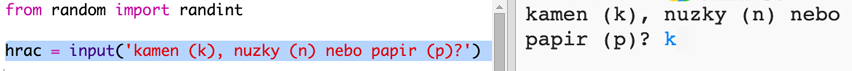
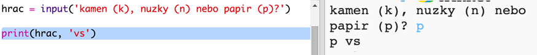

## Tah hráče

Nejprve nechte hráče vybrat kámen, nůžky nebo papír.

+ Otevřete tento trinket: <a href="http://jumpto.cc/rps-go" target="_blank">jumpto.cc/rps-go</a>.

+ Projekt již obsahuje kód pro import funkce, kterou v tomto projektu použijete.
    
    
    
    Později použijete `randint` ke generování náhodných čísel.

+ Nejprve nechte hráče vybrat kámen, nůžky nebo papír napsáním písmene 'r' (rock=kámen), 's' (scissors=nůžky) nebo 'p' (paper=papír).
    
    

+ Vypište, co hráč zvolil:
    
    

+ Otestujte kód kliknutím na tlačítko `Run`. Klikněte do výstupního okna trinketu a zadejte svůj výběr.