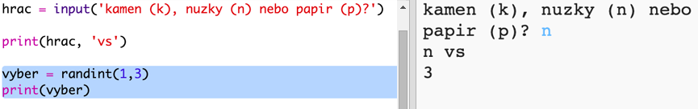
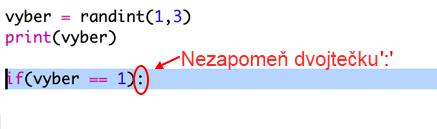
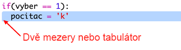
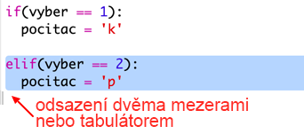
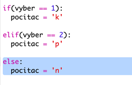
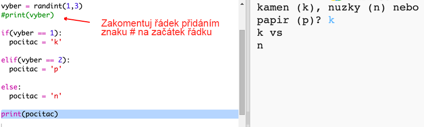
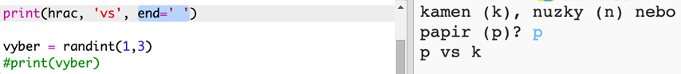

## Tah počítače

Teď je na řadě počítač. Funkci `randint` můžete použít na generování náhodného čísla pro rozhodnutí mezi kamenem, nůžkami a papírem.

+ Použijte funkci `randint` na generování náhodného čísla pro rozhodnutí mezi kamenem, nůžkami a papírem.
    
    

+ Spusťte skript vícekrát (vždy budete muset zadat 'r', 'p' nebo 's').
    
    Měli byste vidět, že 'chosen' je náhodně nastaven na 1, 2 nebo 3.

+ Řekněme, že:
    
    + 1 = rock (r), kámen
    + 2 = paper (p), papír
    + 3 = scissors (s), nůžky
    
    Použijte `if` ke kontrole, zda je zvolené číslo `1` (`==` se používá ke zjištění zda jsou dvě věci stejné).
    
    

+ Python uses **indentation** (moving the code to the right) to show which code is inside the `if`. You can either use two spaces (tap the spacebar twice) or tap the **tab key** (usually above CAPSLOCK on the keyboard.)
    
    Set `computer` to 'r' inside the `if` using indentation:
    
    

+ You can add an alternative check using `elif` (short for *else if*):
    
    
    
    This condition will only be checked if the first condition fails (if the computer didn't choose `1`)

+ And finally, if the computer didn't choose `1` or `2` then it must have chosen `3`.
    
    This time we can just use `else` which means otherwise.
    
    

+ Now, instead of printing out the random number that the computer chose you can print the letter.
    
    
    
    You can either delete the line `print(chosen)`, or make the computer ignore it by adding a `#` at the start of the line.

+ Test your code by clicking Run and choosing your option.

+ Hmm, the computer's choice gets printed on a new line. You can fix that by adding `end=' '` after `vs`, that tells Python to end with a space instead of a new line.
    
    

+ Play the game a few times by clicking Run and making a choice.
    
    For now you'll have to work out who won yourself. Next you'll add the Python code to work this out.