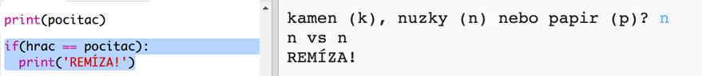
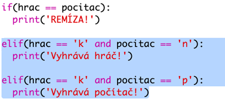
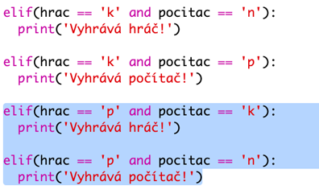
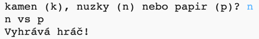

## Check the Result

Pojďme teď přidat kód, který nám ukáže, kdo vyhrál.

+ Abychom zjistili, kdo vyhrál. je třeba porovnat proměnné `player` a `computer`.
    
    Pokud jsou stejné, je to nerozhodně:
    
    

+ Otestujte svůj kód tím, že si několikrát hru zahrajete, dokud nedosáhnete remízy.
    
    Abyste spustili novou hru, budete muset kliknout na `Run`.

+ Nyní se podívejme na případy, kdy hráč zvolil "r" (rock, kámen), ale počítač ne.
    
    Pokud si počítač vybral 's' (scissors, nůžky), vyhrává hráč (kámen tupí nůžky).
    
    Pokud si počítač zvolil 'p' (paper, papír), vyhrává počítač (papír zabalí kámen).
    
    Můžeme zkontrolovat výběr hráče *a* počítače pomocí `and`.
    
    

+ Jako další se podívejme na případy, kdy hráč zvolil 'p' (paper, papír), ale počítač ne:
    
    

+ And finally, can you add the code to check for the winner when the player chose 's' (scissors) and the computer chose rock or paper?

+ Now play the game to test your code.
    
    
    
    Click `Run` to start a new game.