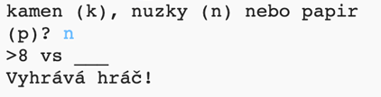
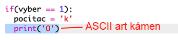
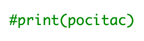
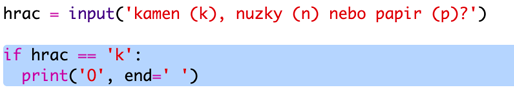

\--- challenge \---

## Výzva: ASCII Art

Dokážete použít ASCII art pro prezentaci kamene, nůžek a papíru místo písmen 'r', 's', a 'p'?

Například:

Kde:

    rock: O
    paper: ___
    scissors: >8
    

+ Místo `print computer` budete muset pro každou z možností do `if` přidat vypsání správného ASCII artu. 

Tipy:

+ Místo `print player` budete muset přidat if pro kontrolu toho, co hráč vybral, a vypsat odpovídající ASCII art:

Tip:

Nezapomeňte, že přidání `end=' '` na konec `print` zajistí, že výpis bude končit mezerou místo novým řádkem.

\--- /challenge \---