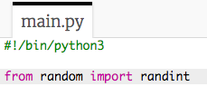
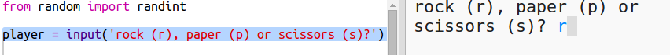
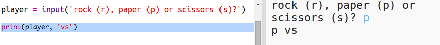

## Tro'r Chwareuwr

Yn gyntaf, fe wnawn ni adael i'r chwareuwr ddewis Carreg, Papur neu Sisiwrn.

+ Agora'r trinket yma: <a href="http://jumpto.cc/rps-go" target="_blank">jumpto.cc/rps-go</a>. 

+ Mae'r prosiect yn barod yn cynnwys côd i fewnbynnu y byddi di yn eu defnyddio yn y prosiect yma.

  
  
  Byddi di'n defnyddio `randint` nes ymlaen i greu rhifau ar hap.

+ Yn gyntaf, fe wnawn ni ofyn i'r chwareuwr ddewis Carreg, Papur neu Sisiwrn trwy deipio'r llythrennau 'c', 'p' neu 's'.

  
  
+ Nawr printia yr hyn mae'r chwareuwr yn gallu ei ddewis:

  
  
+ Profa dy gôd trwy glicio `Run`. Clicia yn y ffenest dde a mewnbynu dy ddewis.  

