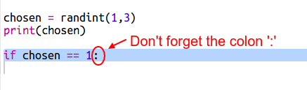

## Tro'r Cyfrifiadur

Tro'r cyfrifiadur yw hi nawr. Fe alli di ddefnyddio `randint` i gynhyrchu rhif ar hap i ddewis rhwng carreg, papur neu sisiwrn. 

+ Defnyddia `randint` i gynhyrchu rhif ar hap i ddewis os yw'r cyfrifiadur wedi dewis carreg, papur neu sisiwrn.

  
  
+ Rheda'r sgript nifer o weithiau (bydd angen i ti fewnbynu 'c', 'p' neu 's' bob tro.) 
  
  Fe ddylet ti weld bod 'dewis' wedi ei osod ar hap i unai 1, 2 neu 3.
  
+ Fe ddwedwn ni:
  
  + 1 = carreg (c)
  + 2 = papur (p)
  + 3 = sisiwn (s)

  Defnyddia `if` i weld os mai'r rhif dewisiedig yw `1` (defnyddir `==` i weld os yw 2 beth yr un peth).
  
  
  
+ Mae python yn defnyddio __bylchau__  (symud y côd i'r dde) i ddangos pa gôd sydd o fewn `if`.  Mae modd unai defnyddio dau fwlch (tapio'r bylchwr ddwywaith) neu defnyddio __tab__ (fel arfer uwchben CAPSLOCK ar y bysellfwrdd).

  Gosoda `cyfrifiadur` i 'c' tu fewn `if` yn defnyddio bylchau:
  
  
  
+ Mae modd defnyddio gwiriad arall yn defnyddio `elif` (sydd yn fyr am _else if_):

  

  Bydd y gorchymyn yma dim ond yn cael ei wirio os yw'r gorchymyn cyntaf yn methu (os nad yw'r cyfrifiadur yn dewis `1`) 
  
+ Ac yn olaf, os nad yw'r cyfrifiadur yn dewis `1` neu `2` yna mae'n rhaid ei fod wedi dewis `3`.

  Y tro hyn gallwn ddefnyddio `else` sydd yn golygu fel arall.
  
  
  
+ Nawr, yn lle argraffu'r rhif ar hap mae'r cyfrifiadur wedi ei ddewis mae modd argraffu llythyren.

   
   
   Mae modd i ti unai ddileu'r llinell `print(dewis)`, neu wneud i'r cyfrifiadur ei anwybyddu trwy ychwanegu `#` ar ddechrau'r llinell.
      
+ Profa'r côd trwy glicio Run a mewnbynu dy ddewis. 

+ Mae dewis y cyfrifiadur yn cael ei argraffu ar linell newydd. Mae modd trwsio hynny trwy ychwanegu `end=' '` ar ôl `yn erbyn`, sydd yn dweud wrth Python i orffen gyda bwlch yn lle llinell newydd.

   
      
+ Chwareua'r gêm ychydig o weithiau trwy glicio Run a gwneud dy ddewis. 

  Am nawr, fe fydd rhaid i ti weithio mas pwy sydd yn ennill dy hunan. Nesaf fe fyddi di'n ychwanegu côd Python i weithio hyn allan.
  

