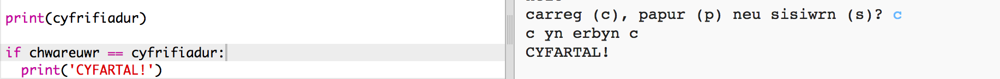
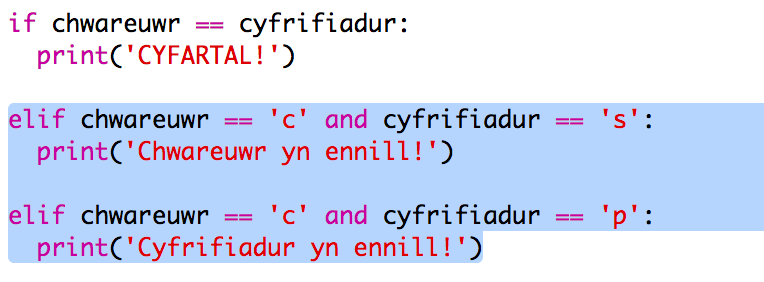
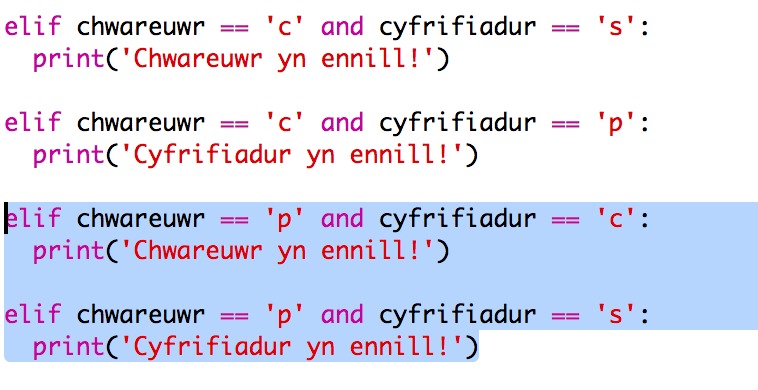
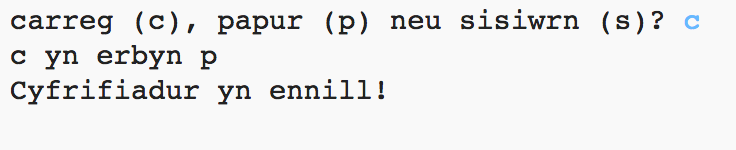

## Gwirio'r Canlyniad

Fe awn ati i ychwanegu'r côd yma i weld pwy sydd wedi ennill.

+ Bydd angen cymharu'r newidyn `chwareuwr` a `cyfrifiadur` i weld pwy sydd wedi ennill.

  Os yw nhw'r un peth yna mae'n gêm gyfartal:
  
  
  
+ Profa dy gôd trwy chwarae'r gêm tan dy fod yn cael gêm gyfartal. 

  Bydd angen clicio `Run` i ddechrau gêm newydd.

+ Nawr fe wnawn ni edrych ar yr achosion lle mae'r chwareuwr yn dewis 'c' (carreg) ond dyw'r cyfrifiadur ddim.

  Os yw'r cyfrifiadur yn dewis 's' (sisiwrn) yna mae'r chwareuwr yn ennill (carreg yn curo sisiwrn).
  
  Os yw'r cyfrifiadur yn dewis 'p' (papur) yna mae'r cyfrifiadur yn ennill (papur yn curo carreg).
  
  Gallwn wirio dewis y chwareuwr *ac* un y cyfrifiadur trwy ddefnyddio `and`.
  
  
  
+ Nesaf fe wnawn ni edrych ar yr achosion lle mae'r chwareuwr yn dewis 'p' (papur) ond dyw'r cyfrifiadur ddim:

  
  
+ Ac yn olaf, alli di ychwanegu'r côd i ddewis yr enillydd pan mae'r chwareuwr yn dewis 's' (sisiwrn) ac mae'r cyfrifiadur yn dewis carreg neu bapur?

+ Nawr rho gynnig ar y gêm i brofi dy gôd.

  

  Clicia `Run` i ddechrau gêm newydd.
  

