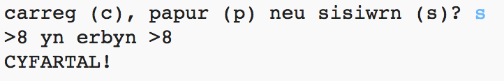
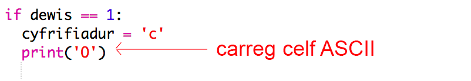
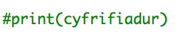

--- challenge ---
## Her: Celf ASCII

Yn lle defnyddio'r llythrennau c, p neu s i gynrychioli carreg, papur neu sisiwrn, alli di ddefnyddio celf ASCII? 

Er enghraifft:



Ble:
```
carreg: O
papur: ___
sisiwrn: >8
```

+ Yn hytrach na dweud `print cyfrifiadur` bydd angen i ti ychwanegu llinell newydd i bob un o'r opsiynau yn `if` i argraffu'r celf ASCII cywir. 

Awgrymiadau:





+ Yn hytrach na dweud `print chwareuwr` bydd angen i ti ychwanegu datganiad 'if' newydd i wirio pa eitem mae'r chwareuwr yn ei ddewis, ac yna argraffu'r celf ASCII cywir:

Awgrym:


Cofia fod ychwanegu `end=' '` ar ddiwedd `print` yn gwneud iddo orffen gyda bwlch yn hytrach na llinell newydd. 


--- /challenge ---
