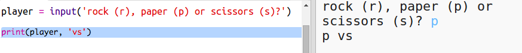

## Spillerens Tur

Først, lad spilleren vælge mellem sten, saks, eller papir.

+ Åben denne trinket: <a href="http://jumpto.cc/rps-go" target="_blank">jumpto.cc/rps-go</a>.

+ Projektet indeholder allerede koden til at hente en funktion, som du skal bruge i dette projekt.
    
    
    
	Du vil senere bruge `randint` til at skabe tilfældige tal.

+ Først, lad spilleren vælge mellem sten, saks, eller papir ved at indtaste bogstaverne 'r', 's', eller 'p' ('r' står for 'rock', som betyder sten på engelsk).
    
    

+ Udskriv derefter, hvad spilleren har valgt:
    
    

+ Test din kode ved at klikke `Run`. Klik i trinket output-vinduet og indtast dit valg.