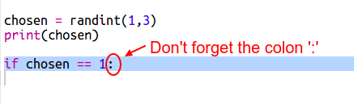

## Computerens Tur

Nu er det computerens tur. Du kan bruge `randint` funktionen til at generere et tilfældigt tal for at vælge mellem sten, saks, og papir.

+ Brug `randint` til a generere et tilfældigt tal for at se, om computeren har valgt enten sten, saks, eller papir.
    
    

+ Kør dit script flere gange i streg (du har brug for at indtaste 'r', 's', eller 'p' hver gang)
    
    Du burde se at 'chosen' er tilfældigt sat til enten 1, 2, eller 3.

+ Lad os antage, at:
    
    + 1 = sten (r)
    + 2 = saks (s)
    + 3 = papir (p)
    
    Brug `if` for at checke, om det valgte nummer er `1` (`==` bruges for at checke, om 2 ting er de samme).
    
    

+ Python bruger **indrykning** (flytte kode til højre) for at vise, hvilken kode er inde i en `if`. Du kan enten bruge to mellemrum (tryk mellemrumstasten to gange), eller trykke **tabulatortasten** (tasten er normalt over CAPSLOCK på keyboardet)
    
    Sæt `computer` til 'r' inde i `if` ved at bruge indryking:
    
    

+ Du kan tilføje en anden form for check ved at bruge `elif` (kort for *else if*):
    
    
    
    Denne betingelse vil kun blive checket, hvis den første betingelse fejler (hvis computeren ikke valgte `1`)

+ Endelig, hvis computeren ikke har valgt `1` eller `2`, så må den have valgt `3`.
    
    Denne gang kan vi blot bruge `else`, som betyder 'ellers', og som bruges hvis alle andre betingelser før den fejler.
    
    

+ Nu kan du udskrive bogstavet, i stedet for det tilfældige tal som computeren har valgt.
    
    
    
    Du kan enten slette linjen `print(chosen)`, eller få computeren til at ignorere den ved at tilføje et `#` som det allerførste på linjen.

+ Test din kode ved at klikke Run og indtaste dit valg.

+ Hmm, computerens valg bliver udskrevet på en ny linje. du kan fikse dette ved at tilføje `end=' '` efter `vs`. Dette fortæller Python, at udskriften skal slutte med et mellemrum i stedet for en ny linje.
    
    

+ Spil spillet et par gange ved at klikke Run og lave dit valg.
    
    Lige nu er du nødt til selv at finde ud af, hvem der vandt. Efterfølgende vil du tilføje Python-koden der automatisk vil gøre dette.