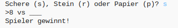

## Einführung

In diesem Projekt wirst du ein „Schere, Stein, Papier“ Spiel erstellen und gegen deinen Computer spielen.  

Regeln: Du und dein Computer wählt beide entweder Schere, Stein oder Papier. Der Gewinner wird durch die folgenden Regeln ermittelt:

+ Der Stein stumpft die Schere ab
+ Das Papier umwickelt den Stein
+ Die Schere zerschneidet das Papier

  <iframe src="https://trinket.io/embed/python/e1e1d873be?outputOnly=true&start=result" width="600" height="500" frameborder="0" marginwidth="0" marginheight="0" allowfullscreen>
  </iframe>
  

## Online Ressourcen

__Dieses Projekt benutzt Python 3.__ Wir empfehlen die Nutzung von [trinket](https://trinket.io/), um Python online zu schreiben. Dieses Projekt enthält die folgenden Trinkets:

+ [‘Rock, Paper, Scissors’ Resources -- jumpto.cc/rps-go](http://jumpto.cc/rps-go)

Es gibt auch ein Trinket, welches das abgeschlossene Projekt enthält:

+ [‘Rock, Paper, Scissors’ Finished -- trinket.io/python/e1e1d873be](https://trinket.io/python/e1e1d873be)

## Offline Ressourcen
Dieses Projekt kann [offline beendet werden](https://www.codeclubprojects.org/en-GB/resources/python-working-offline/), falls gewünscht. Zugang zu den Projekt-Ressourcen ist durch das Klicken auf den „Projekt-Materialien“ Link für dieses Projekt möglich. Dieser Link enthält einen Abschnitt über „Projekt-Ressourcen“, die u.a. auch Ressourcen beinhalten, welche die Kinder benötigen, um dieses Projekt offline beenden zu können. Achten Sie darauf, dass jedes Kind Zugang zu einer Kopie dieser Ressourcen hat. Dieser Abschnitt enthält die folgenden Dateien:

+ rock-paper-scissors/rock-paper-scissors.py

Sie finden eine vollständige und fertige Version dieses Projekts im Abschnitt „Helfer Ressourcen“, der u.a. Folgendes enthält:

+ rock-paper-scissors-finished/rock-paper-scissors.py

(Alle der o.g. Ressourcen können auch als Projekt und Helfer `.zip` Dateien heruntergeladen werden.)

## Lernziele
+ Variable;
+ Auswahlkriterien (`if`, `elif`, `else`); 
+ Boolesche Funktionen `==` und `and`.

Dieses Projekt deckt Elemente aus den folgenden Bereichen des [Raspberry Pi Lehrplans zur digitalen Produktion](http://rpf.io/curriculum):

+ [Einfach Programmierungskonstrukte benutzen, um einfache Programme zu erstellen.](https://www.raspberrypi.org/curriculum/programming/creator)

## Aufgaben
+ „ASCII Bilder“ - Benutze bedingte Logik, um ASCII Bilder für „Schere, Stein, Papier“ zu erstellen. 
+ „Neues Spiel erstellen” – Kopiere das „Schere, Stein, Papier“ Spiel und mische es erneut, um ein neues Spiel zu erstellen. 
