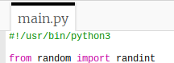
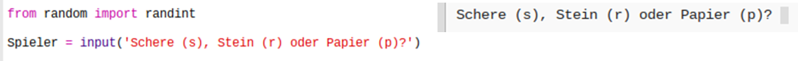
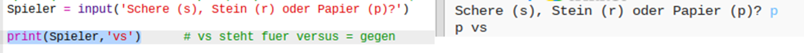

## Der Spieler ist dran

Lass als Erstes den Spieler entweder die Schere, den Stein oder das Papier wählen. 

+ Dieses Trinket öffnen: <a href="http://jumpto.cc/rps-go" target="_blank">jumpto.cc/rps-go</a>. 

+ Das Projekt enthält bereits den Code, um eine Funktion zu importieren, die du für dieses Projekt benutzen wirst. 

  
  
  Du wirst später die Funktion `randint` benutzen, um eine zufällig ausgewählte Zahl zu erstellen.

+ Lasse als erstes den Spieler entweder die Schere, den Stein oder das Papier wählen, indem du die folgenden Buchstaben eintippst: 'r' (wörtlich: „rock“, also der Stein), 'p' (wörtlich: „paper“, also das Papier) oder 's' (wörtlich: „scissors“, also die Schere). 

  
  
+ Drucke jetzt aus, was der Spieler gewählt hat:

  
  
+ Teste deinen Code, indem du auf `Run` (Programm laufen lassen) klickst. Klicke im Trinket das Output Fenster und gib deine Wahl ein. 

