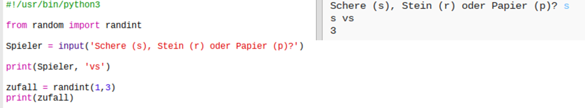
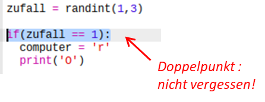
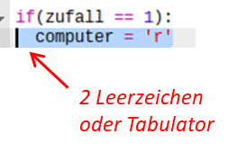
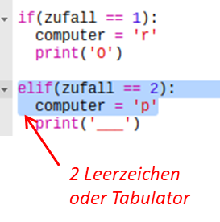
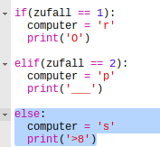
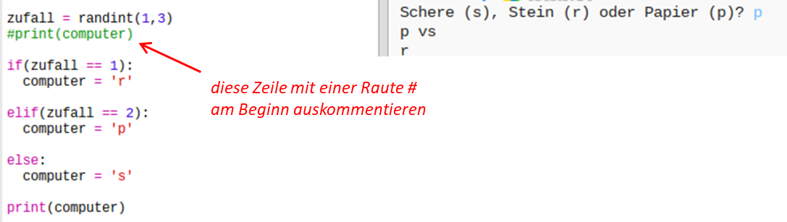
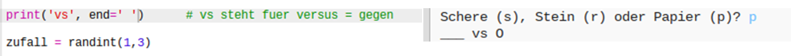

## Der Computer ist dran

Jetzt ist der Computer dran. Du kannst die `randint` Funktion benutzen, um ein zufällig ausgewählte Zahl zu erstellen, um so zwischen Schere, Stein oder Papier zu entscheiden. 

+ Benutze die `randint` Funktion, um eine zufällig ausgewählte Zahl zu erstellen und so zu entscheiden, ob der Computer den Stein, das Papier oder die Schere gewählt hat. 

  
  
+ Lasse dein Script viele Male laufen (du musst jedes Mal wieder 'r' (Stein), 'p' (Papier) oder 's' (Schere) eingeben.)
  
  Du solltest sehen können, dass 'chosen' (ausgewählt) beliebig auf 1, 2 oder 3 eingestellt ist. 
  
+ Z. B.:
  
  + 1 = Stein (r)
  + 2 = Papier (p)
  + 3 = Schere (s)

  Benutze `if` (wenn), um zu sehen, ob die gewählte Zahl `1` ist (`==` wird benutzt, um zu sehen, ob 2 Dinge gleich sind). 
  
  
  
+ Python benutzt __Einrückung__ (bewege den Code nach rechts), um zu zeigen, welcher Code innerhalb von `if` (wenn) liegt. Du kannst entweder zwei Leerzeichen benutzen (zweimal die Leertaste betätigen) oder die __Tabulatortaste __ drücken (sie ist normalerweise oberhalb der Feststelltaste für Groß- und Kleinschreibung auf der Tastatur zu finden.)

  Stelle den `computer` auf 'r' (Stein) innerhalb von `if` (wenn) mit Hilfe der Einrückung:
  
  
  
+ Du kannst einen alternativen Check mit Hilfe von `elif` (eine Abkürzung für _else if_ (oder wenn)) hinzufügen:

  

  Dieser Zustand wird nur geprüft, wenn der erste Zustand versagt (wenn der Computer nicht `1` gewählt hat)
  
+ Und abschließend, wenn der Computer nicht `1` oder `2` gewählt hat, dann muss er `3` gewählt haben. 

  Dieses Mal können wir nur `else` benutzen, was „andernfalls“ bedeutet. 
  
  
  
+ Jetzt kannst du, statt nur die beliebige Zahl zu drucken, welche der Computer gewählt hat, den Buchstaben drucken. 

   
   
   Du kannst entweder die Zeile `print(chosen)` (drucken (gewählt)) löschen oder den Computer dazu bringen, dies zu ignorieren, indem du ein `#` zu Beginn der Zeile einfügst.
      
+ Teste deinen Code, indem du auf Run (Programm laufen lassen) klickst und deine Option auswählst. 

+ Hmm, die Wahl des Computers wird auf einer neuen Zeile gedruckt. Du kannst dieses Problem beheben, indem du `end=' '` (Ende) nach `vs` (versus) hinzufügst, hierdurch teilst du Python mit, mit einem Leerzeichen anstelle einer neuen Zeile zu enden. 

   
      
+ Spiele das Spiel ein paar Mal, indem du auf Run (Programm laufen lassen) klickst und eine Wahl triffst.

  Vorerst musst du selbst herausfinden, bzw. bestimmen, wer gewonnen hat. Als Nächstes wirst du den Python Code hinzufügen, um zu bestimmen, wer gewonnen hat.   

