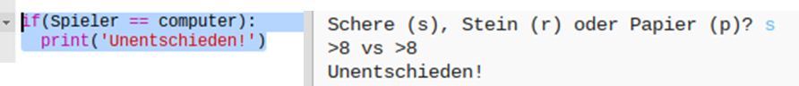
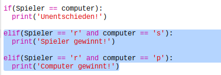
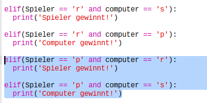
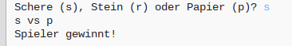

## Das Ergebnis prüfen

Lass uns jetzt den Code hinzufügen, um zu sehen, wer gewonnen hat. 

+ Du musst die `player` (Spieler) und `computer` (Computer) Variablen miteinander vergleichen, um zu sehen, wer gewonnen hat. 

  Wenn beide gleich sind, dann ist das Spiel unentschieden:
  
  
  
+ Teste deinen Code, indem du das Spiel ein paar Mal spielst bis du ein Unentschieden erhältst. 

  Du musst auf `Run` (Programm laufen lassen) klicken, um ein neues Spiel zu starten. 

+ Lass uns jetzt die Fälle näher betrachten, wo der Spieler 'r' (den Stein) gewählt hat, nicht aber der Computer. 

  Wenn der Computer 's' (die Schere) gewählt hat, dann gewinnt der Spieler (der Stein übertrumpft die Schere). 
  
  Wenn der Computer 'p' (das Papier) gewählt hat, dann gewinnt der Computer (das Papier übertrumpft den Stein).
  
  Wir können die Wahl des Spielers überprüfen *und* die Wahl des Computers mit Hilfe von `and` (und).
  
  
  
+ Lass uns als Nächstes die Fälle näher betrachten, bei denen der Spieler 'p' (das Papier) gewählt hat, nicht aber der Computer:

  
  
+ Und zum Schluss, kannst du den Code hinzufügen, um den Gewinner zu ermitteln, wenn der Spieler 's' (die Schere) und der Computer den Stein oder das Papier gewählt hat?

+ Spiele jetzt das Spiel, um deinen Code zu testen. 

  

  Klicke auf `Run` (Programm laufen lassen), um ein neues Spiel zu beginnen. 

