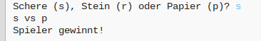
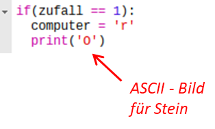
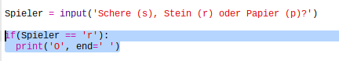

--- challenge ---
## Aufgabe: ASCII Bilder

Anstatt die Buchstaben “r” (Stein), “p” (Papier) und “s” (Schere) zu benutzen, um entsprechend den Stein, das Papier und die Schere darzustellen, kannst du versuchen, es mit ASCII Bildern zu machen?

Zum Beispiel:



Wobei:
```
Stein: O
Papier: ___
Schere: >8
```

+ Anstatt zu sagen: `print computer` (Computer drucken) musst du jetzt eine neue Zeile jeder der Optionen beim `if` (wenn) hinzufügen, um das korrekte ASCII Bild auszudrucken. 

Tipps:




+ Anstatt zu sagen: `print player` (Spieler drucken) musst du jetzt ein neues if (wenn) Statement hinzufügen, um zu prüfen, welches Element der Spieler gewählt hat und dann das korrekte ASCII Bild ausdrucken:

Tipp:



Denke daran, dass das Hinzufügen von `end=' '` (Ende) am Ende von `print` (drucken) dazu führt, dass es mit einem Leerzeichen endet anstelle einer neuen Zeile. 


--- /challenge ---