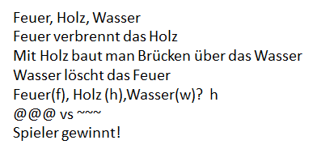

--- challenge ---

## Aufgabe: Ein neues Spiel erstellen

Kannst du dein eigenes Spiel wie Schere, Stein, Papier mit andersartigen Objekten erstellen?

Klicke auf die Schaltfläche "Duplizieren", um eine Kopie deines Schere, Stein, Papier-Projekts anzufertigen.

In diesem Beispiel werden Feuer, Wasser und Holz verwendet:

--- /challenge ---

***
Dieses Projekt wurde von freiwilligen Helfern übersetzt:

**Bernd Albrecht**

**Karl Schuh**

Dank freiwilliger Helfer können wir Menschen auf der ganzen Welt die Möglichkeit geben, in ihrer eigenen Sprache zu lernen. Du kannst uns helfen, mehr Menschen zu erreichen, indem Du dich freiwillig zum Übersetzen meldest - weitere Informationen unter [rpf.io/translate](https://rpf.io/translate).
