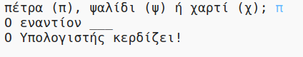

## Εισαγωγή

Σε αυτό το έργο θα κάνεις ένα παιχνίδι Πέτρα, Ψαλίδι, Χαρτί και θα παίξεις εναντίον του υπολογιστή.

Κανόνες: Εσύ και ο υπολογιστής επιλέγετε Πέτρα, Ψαλίδι ή Χαρτί. Ο νικητής αναδεικνύεται με βάση αυτούς τους κανόνες:

* Η Πέτρα σπάει το Ψαλίδι
* Το Χαρτί τυλίγει την Πέτρα
* Το Ψαλίδι κόβει το Χαρτί

  <iframe src="https://trinket.io/embed/python/e1e1d873be?outputOnly=true&start=result" width="600" height="500" frameborder="0" marginwidth="0" marginheight="0" allowfullscreen>
  </iframe>
  

### Πρόσθετες πληροφορίες για τους συντονιστές των ομάδων

Αν χρειαστεί να εκτυπώσεις αυτό το έργο, χρησιμοποίησε την [εκτυπώσιμη έκδοση](https://projects.raspberrypi.org/en/projects/rock-paper-scissors/print).

## \--- collapse \---

## title: Σημειώσεις συντονιστή ομάδας

## Εισαγωγή:

Σε αυτό το έργο, τα παιδιά θα μάθουν πώς να κάνουν ένα πρόγραμμα που παίζει το παιχνίδι Πέτρα, Ψαλίδι, Χαρτί χρησιμοποιώντας μεταβλητές και δηλώσεις συνθήκης.

## Online Πόροι

**Αυτό το έργο χρησιμοποιεί Python 3.** Συνιστούμε να χρησιμοποιήσετε το [trinket](https://trinket.io/) για να γράψετε Python online. Αυτό το έργο περιλαμβάνει τα ακόλουθα trinkets:

* [‘Πέτρα, Ψαλίδι, Χαρτί’ Πόροι -- jumpto.cc/rps-go](http://jumpto.cc/rps-go)

Υπάρχει επίσης ένα trinket που περιέχει το ολοκληρωμένο έργο:

* [‘Πέτρα, Ψαλίδι, Χαρτί’ Ολοκληρωμένο -- trinket.io/python/e1e1d873be](https://trinket.io/python/e1e1d873be)

## Offline Πόροι

Αυτό το έργο μπορεί να [ολοκληρωθεί χωρίς σύνδεση](https://www.codeclubprojects.org/en-GB/resources/python-working-offline/) αν προτιμάς. Μπορείς να αποκτήσεις πρόσβαση στους πόρους του έργου κάνοντας κλικ στο σύνδεσμο 'Υλικό έργου'. Αυτός ο σύνδεσμος περιέχει μια ενότητα 'Πόροι έργου', η οποία περιλαμβάνει πόρους που τα παιδιά θα χρειαστούν για να ολοκληρώσουν αυτό το έργο εκτός σύνδεσης. Βεβαιώσου ότι κάθε παιδί έχει πρόσβαση σε ένα αντίγραφο αυτών των πόρων. Αυτή η ενότητα περιλαμβάνει τα ακόλουθα αρχεία:

* rock-paper-scissors/rock-paper-scissors.py

Μπορείς επίσης να βρείτε μια ολοκληρωμένη έκδοση αυτού του έργου στην ενότητα 'Πόροι εθελοντών', η οποία περιέχει:

* rock-paper-scissors-finished/rock-paper-scissors.py

(Όλοι οι παραπάνω πόροι μπορούν επίσης να κατέβουν ως συμπιεσμένα `.zip` αρχεία.)

## Στόχοι μάθησης

* Μεταβλητές
* Επιλογή (`if`, `elif`, `else`) 
* Λογικές πράξεις `==` και `and`.

Αυτό το έργο περιλαμβάνει στοιχεία από το παρακάτω μάθημα του [Raspberry Pi Digital Curriculum Making](http://rpf.io/curriculum):

* [Χρησιμοποίησε βασικές δομές προγραμματισμού για να δημιουργήσεις απλά προγράμματα.](https://www.raspberrypi.org/curriculum/programming/creator)

## Προκλήσεις

* "Τέχνη ASCII" - Εμφάνισε σύμβολα ASCII στη θέση των επιλογών Πέτρα, Ψαλίδι και Χαρτί, ανάλογα με τις επιλογές του παίκτη και του υπολογιστή. 
* "Δημιούργησε ένα νέο παιχνίδι" - Αντέγραψε το παιχνίδι Πέτρα, Ψαλίδι, Χαρτί και τροποποίησέ το για να δημιουργήσεις ένα νέο παιχνίδι. 

\--- /collapse \---

## \--- collapse \---

## title: Υλικό έργου

## Πόροι έργου

* [αρχείο .zip που περιέχει όλους τους πόρους του έργου](resources/rock-paper-scissors-project-resources.zip)
* [Online Trinket που περιέχει όλους τους πόρους του έργου 'Πέτρα, Ψαλίδι, Χαρτί'](http://jumpto.cc/rps-go)
* [rock-paper-scissors/rock-paper-scissors.py](resources/rock-paper-scissors-rock-paper-scissors.py)

## Πόροι συντονιστή ομάδας

* [αρχείο .zip που περιέχει όλους τους πόρους του έργου](resources/rock-paper-scissors-volunteer-resources.zip)
* [Online ολοκληρωμένο έργο στο Τrinket](https://trinket.io/python/e1e1d873be)
* [rock-paper-scissors-finished/rock-paper-scissors.py](resources/rock-paper-scissors-finished-rock-paper-scissors.py)

\--- /collapse \---