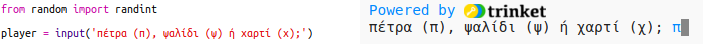
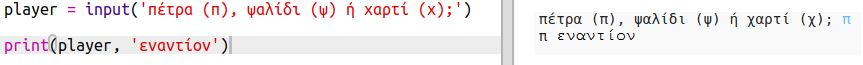

## Σειρά του παίκτη

Αρχικά, αφήνεις τον παίκτη να επιλέξει Πέτρα, Ψαλίδι ή Χαρτί.

+ Άνοιξε αυτό το trinket: <a href="http://jumpto.cc/rps-go" target="_blank">jumpto.cc/rps-go</a>.

+ Το trinket περιέχει ήδη τον κώδικα για την εισαγωγή μιας συνάρτησης που πρόκειται να χρησιμοποιήσεις σε αυτό το έργο.
    
    
    
    Θα χρησιμοποιήσεις την `randint` αργότερα για την παραγωγή τυχαίων αριθμών.

+ Πρώτα, αφήνεις τον παίκτη να επιλέξει Πέτρα, Ψαλίδι ή Χαρτί πληκτρολογώντας το γράμμα 'π', 'ψ' ή 'χ'.
    
    

+ Τώρα εμφάνισε αυτό που επέλεξε ο παίκτης:
    
    

+ Δοκίμασε τον κώδικά σου κάνοντας κλικ στο `Run`. Πάτησε στο παράθυρο εξόδου του trinket και εισήγαγε την επιλογή σου.