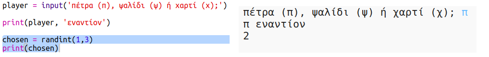
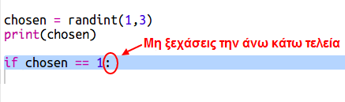
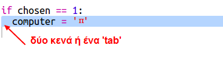
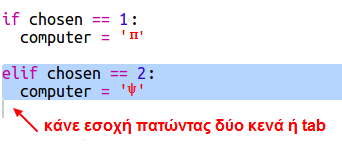
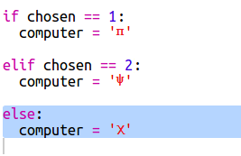
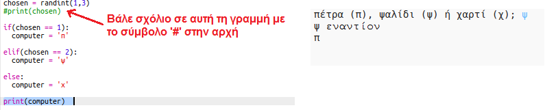
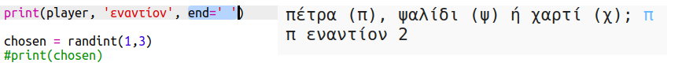

## Σειρά του υπολογιστή

Τώρα είναι η σειρά του υπολογιστή. Μπορείς να χρησιμοποιήσεις τη συνάρτηση `randint` για να παράγεις έναν τυχαίο αριθμό ώστε να αποφασίσεις ανάμεσα σε πέτρα, ψαλίδι ή χαρτί.

+ Χρησιμοποίησε την `randint` για να παράγεις έναν τυχαίο αριθμό ώστε να αποφασίσεις εάν ο υπολογιστής έχει επιλέξει πέτρα, ψαλίδι ή χαρτί.
    
    

+ Εκτέλεσε το σενάριό σου πολλές φορές (θα πρέπει να εισάγεις κάθε φορά "π", "ψ" ή "χ").
    
    Θα δεις ότι η μεταβλητή 'chosen' παίρνει τυχαία μία από τις τιμές 1, 2 ή 3.

+ Ας θεωρήσουμε:
    
    + 1 = Πέτρα (π)
    + 2 = Ψαλίδι (ψ)
    + 3 = Χαρτί (χ)
    
    Χρησιμοποίησε το `if` για να ελέγξεις αν ο επιλεγμένος αριθμός είναι `1` (το σύμβολο ` == ` χρησιμοποιείται για να ελέγξουμε αν 2 πράγματα είναι ίδια).
    
    

+ Η Python χρησιμοποιεί **εσοχές** (μετακίνηση του κώδικα προς τα δεξιά) για να δείξει ποιος κώδικας βρίσκεται μέσα στο `if`. Μπορείς είτε να πατήσεις δύο κενά (δύο φορές το πλήκτρο διαστήματος) είτε να πατήσεις το πλήκτρο **tab** (συνήθως πάνω από το CAPSLOCK στο πληκτρολόγιο.)
    
    Όρισε το `computer` σε 'π' μέσα στο `if` χρησιμοποιώντας εσοχή:
    
    

+ Μπορείς να προσθέσεις έναν εναλλακτικό έλεγχο χρησιμοποιώντας το `elif` (σύντμηση για το *else if*):
    
    
    
    Αυτή η συνθήκη θα ελεγχθεί μόνο αν η πρώτη συνθήκη αποτύχει (αν ο υπολογιστής δεν επέλεξε `1`)

+ Τέλος, αν ο υπολογιστής δεν επέλεξε `1` ή `2` τότε πρέπει να έχει επιλέξει `3`.
    
    Αυτή τη φορά μπορείς να χρησιμοποιήσεις μόνο το `else` που σημαίνει διαφορετικά.
    
    

+ Τώρα, αντί να εμφανίσεις τον τυχαίο αριθμό που επέλεξε ο υπολογιστής, μπορείς να εμφανίσεις το γράμμα.
    
    
    
    Μπορείς είτε να διαγράψεις την γραμμή `print(choosen)`, ή να κάνεις τον υπολογιστή να την αγνοήσει προσθέτοντας ένα `#` στην αρχή της γραμμής.

+ Δοκίμασε τον κώδικά σου κάνοντας κλικ στο Run και κάνοντας την επιλογή σου ('π', 'ψ' ή 'χ').

+ Χμμ, η επιλογή του υπολογιστή εμφανίζεται σε μια νέα γραμμή. Μπορείς να το διορθώσεις προσθέτοντας `end=' '` μετά από `vs`, που λέει στην Python να τελειώνει με ένα διάστημα αντί με μια νέα γραμμή.
    
    

+ Παίξε το παιχνίδι μερικές φορές πατώντας Run και κάνοντας μια επιλογή.
    
    Προς το παρόν θα πρέπει να καταλάβεις ο ίδιος ποιος κέρδισε. Στη συνέχεια θα προσθέσεις τον κώδικα της Python για να καταφέρεις να πραγματοποιείται αυτόματα.