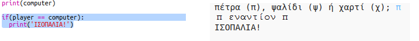
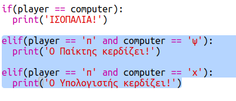
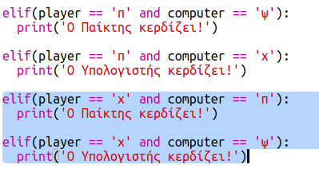
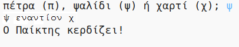

## Έλεγξε το αποτέλεσμα

Τώρα, πρόσθεσε τον κώδικα για να δεις ποιος κέρδισε.

+ Πρέπει να συγκρίνεις τις μεταβλητές `player` και `computer` για να δεις ποιος κέρδισε.
    
    Αν είναι ίδιες τότε έχουμε ισοπαλία.
    
    

+ Δοκίμασε τον κώδικά σου παίζοντας το παιχνίδι μερικές φορές μέχρι να υπάρξει ισοπαλία.
    
    Θα χρειαστεί να κάνεις κλικ στο `Run` για να ξεκινήσεις ένα νέο παιχνίδι.

+ Τώρα ας δούμε τις περιπτώσεις όπου ο παίκτης επέλεξε 'π' (πέτρα) αλλά ο υπολογιστής όχι.
    
    Εάν ο υπολογιστής επέλεξε 'ψ' (ψαλίδι), τότε ο παίκτης κερδίζει (πέτρα νικά ψαλίδι).
    
    Εάν ο υπολογιστής επέλεξε 'χ' (χαρτί), τότε ο υπολογιστής κερδίζει (χαρτί νικά πέτρα).
    
    Μπορούμε να ελέγξουμε την επιλογή του παίκτη *και* την επιλογή του υπολογιστή χρησιμοποιώντας το `and`.
    
    

+ Τώρα ας δούμε τις περιπτώσεις όπου ο παίκτης επέλεξε 'χ' (χαρτί) αλλά ο υπολογιστής όχι.
    
    

+ Και τέλος, μπορείς να προσθέσεις τον κώδικα για να ελέγξεις τον νικητή όταν ο παίκτης επέλεξε 'ψ' (ψαλίδι) και ο υπολογιστής επέλεξε πέτρα ή χαρτί;

+ Τώρα παίξε το παιχνίδι για να δοκιμάσεις τον κώδικά σου.
    
    
    
    Πάτησε `Run` για να ξεκινήσεις ένα νέο παιχνίδι.