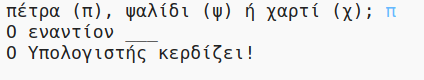
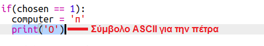
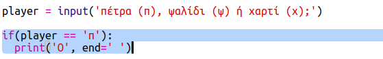

--- challenge ---

## Πρόκληση: Τέχνη ASCII

Αντί να χρησιμοποιείς τα γράμματα π, ψ και χ για να αναπαριστάς πέτρα, ψαλίδι και χαρτί, μπορείς να χρησιμοποιήσεις σύμβολα ASCII;

Για παράδειγμα:

Όπου:

    πέτρα: O
    ψαλίδι: >8
    χαρτί: ___
    
    

+ Αντί να λες `print computer`, θα πρέπει να προσθέσεις μια νέα γραμμή σε κάθε μία από τις επιλογές στη δήλωση `if` για να εκτυπώσεις το σωστό σύμβολο ASCII. 

Υποδείξεις:

+ Αντί να λες `print player` θα πρέπει να προσθέσεις μια νέα δήλωση if για να ελέγχεις ποιο στοιχείο επέλεξε ο παίκτης και να εκτυπώνεις το σωστό σύμβολο ASCII:

Υπόδειξη:

Θυμήσου ότι προσθέτοντας `end=' '` στο τέλος μιας `print` κάνει το πρόγραμμα να τελειώνει με ένα διάστημα αντί με μια νέα γραμμή.

--- /challenge ---