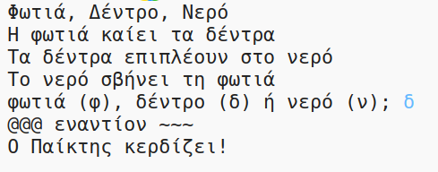

--- challenge ---

## Πρόκληση: Δημιούργησε ένα νέο παιχνίδι

Μπορείς να δημιουργήσεις το δικό σου παιχνίδι όπως το Πέτρα, Ψαλίδι, Χαρτί αλλά με διαφορετικά αντικείμενα;

Πάτησε το κουμπί "Duplicate" για να δημιουργήσεις ένα αντίγραφο του έργου Πέτρα, Ψαλίδι, Χαρτί, από το οποίο θα ξεκινήσεις.

Αυτό το παράδειγμα χρησιμοποιεί Φωτιά, Δέντρο και Νερό:

--- /challenge ---

***
Το έργο αυτό μεταφράστηκε από τους εθελοντές:

**Γιώργος Νικολαΐδης**

**Μάνος Ζεάκης**

Χάρη στους εθελοντές, μπορούμε να δώσουμε σε ανθρώπους σε όλο τον κόσμο την ευκαιρία να μάθουν στη γλώσσα τους. Μπορείτε να μας βοηθήσετε να προσεγγίσουμε περισσότερους ανθρώπους μεταφράζοντας εθελοντικά - περισσότερες πληροφορίες στο [rpf.io/translate](https://rpf.io/translate).
