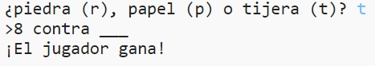

## Introducción

En este proyecto harás un juego de piedra, papel o tijeras, y jugarás contra la computadora.

Reglas: Tú y la computadora elegís piedra, papel o tijeras. El ganador se decide por estas reglas:

* Piedra mella tijeras
* Papel cubre piedra
* Tijeras cortan papel

  <iframe src="https://trinket.io/embed/python/ac6202ffd9?outputOnly=true&start=result" width="600" height="500" frameborder="0" marginwidth="0" marginheight="0" allowfullscreen>
  </iframe>
  

### Información adicional para líderes de clubes

Si necesitas imprimir este proyecto, usa la [versión para imprimir](https://projects.raspberrypi.org/es-ES/projects/rock-paper-scissors/print).

--- collapse ---
---
title: Notas para el líder del club
---

## Introducción:

En este proyecto, los niños aprenderán a hacer un programa que juega a piedra, papel, tijeras con variables y condicionales.

## Recursos en línea

**Este proyecto usa Python 3.** Recomendamos el uso de [trinket](https://trinket.io/) para escribir Python en línea. Este proyecto contiene los Trinkets siguientes:

* [Recursos de "Piedra, papel, tijeras" - jumpto.cc/rps-go](http://jumpto.cc/rps-go)

También hay un Trinket que contiene el proyecto completo:

* ['Piedra, papel, tijeras' finalizado - trinket.io/python/ac6202ffd9](https://trinket.io/python/ac6202ffd9)

## Recursos sin conexión

Este proyecto se puede [completar sin conexión](https://www.codeclubprojects.org/en-GB/resources/python-working-offline/) si se prefiere. Se puede acceder a los recursos del proyecto haciendo clic en el enlace 'Materiales del proyecto'. Este enlace contiene una sección de 'Recursos del proyecto', que incluye los recursos que los niños necesitarán para completar este proyecto sin conexión. Asegúrate de que cada niño tenga acceso a una copia de estos recursos. Esta sección incluye los siguientes archivos:

* rock-paper-scissors/rock-paper-scissors.py

También se puede encontrar una versión completa de este proyecto en la sección 'Recursos para voluntarios', que contiene:

* rock-paper-scissors-finished/rock-paper-scissors.py

(Todos los recursos anteriores también se pueden descargar como archivos `.zip` de proyectos y voluntarios.)

## Objetivos de aprendizaje

* Variables;
* Selección (`if`, `elif `, `else`); 
* Booleano `==` y `and`.

Este proyecto incluye elementos de los siguientes aspectos del [Currículo de creación digital de Raspberry Pi](http://rpf.io/curriculum):

* [Usar estructuras de programación básicas para crear programas simples.](https://www.raspberrypi.org/curriculum/programming/creator)

## Desafíos

* "Arte ASCII": utiliza la lógica condicional para mostrar arte ASCII para piedra, papel y tijeras. 
* "Crea un nuevo juego": duplica el juego Rock, Paper, Scissors y modifícalo para crear un nuevo juego. 

--- /collapse ---

--- collapse ---
---
title: Materiales del proyecto
---

## Recursos del proyecto

* [archivo .zip que contiene todos los recursos del proyecto](resources/rock-paper-scissors-project-resources.zip)
* [Trinket en línea que contiene todos los recursos del proyecto 'Piedra, papel, tijeras'](http://jumpto.cc/rps-go)
* [rock-paper-scissors/rock-paper-scissors.py](resources/rock-paper-scissors-rock-paper-scissors.py)

## Recursos para los líderes de clubes

* [archivo .zip que contiene todos los recursos de proyecto completo](resources/rock-paper-scissors-volunteer-resources.zip)
* [Proyecto en línea de Trinket](https://trinket.io/python/ac6202ffd9)
* [rock-paper-scissors-finished/rock-paper-scissors.py](resources/rock-paper-scissors-finished-rock-paper-scissors.py)

--- /collapse ---