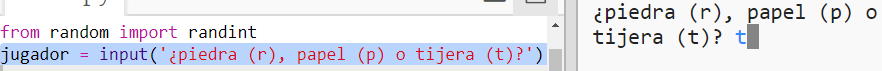
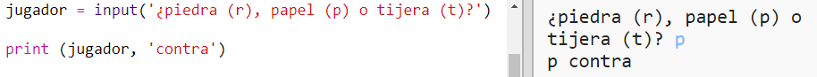

## Turno del jugador

Primero, deja que el jugador elija Piedra, Papel o Tijeras.

+ Abre este tinket: <a href="http://jumpto.cc/rps-go" target="_blank"> jumpto.cc/rps-go </a>.

+ El proyecto ya contiene el código para importar una función que vas a usar.
    
    
    
    Más adelante utilizarás `randint` para generar números aleatorios.

+ Primero, deja que el jugador elija Piedra, Papel o Tijeras escribiendo la letra 'r', 'p' o 't'.
    
    

+ Ahora imprime lo que eligió el jugador:
    
    

+ Prueba tu código haciendo clic en `Ejecutar`. Haz clic en la ventana de salida de trinket e introduce tu elección.