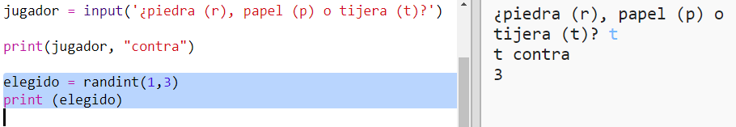
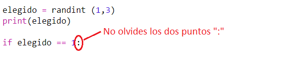
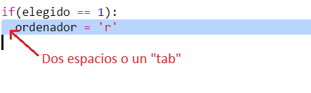
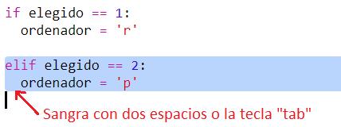
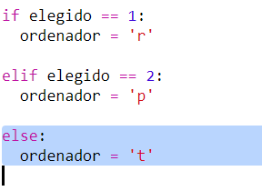
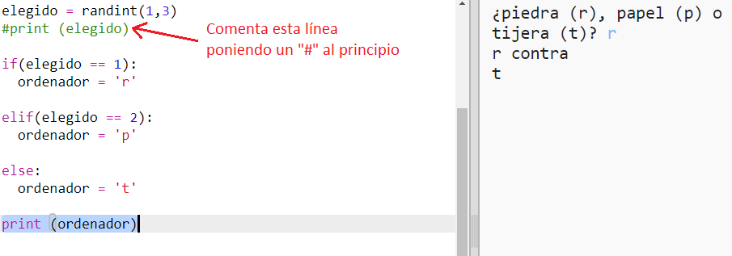
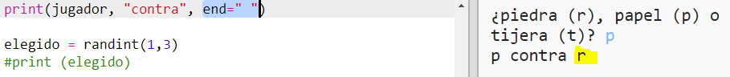

## Turno del ordenador

Es el turno del ordenador. Podrás usar la función `randint` para generar un número de forma aleatoria que decida entre piedra, papel o tijera. 

+ Usa `randint` para generar de forma aleatoria un número que seleccione la opción del ordenador. 

  
  
+ Ejecuta tu script numerosas veces (necesitarás introducir cada vez 'r', 'p' o 's'). 
  
  Comprobarás que 'chosen' se ajusta de forma aleatoria en 1, 2 o 3. 
  
+ Digamos por ejemplo:
  
  + 1 = piedra (r)
  + 2 = papel (p)
  + 3 = tijeras (s)

  Usa `if` para comprobar si el número seleccionado es  `1` (`==` se usa para comprobar si  2 cosas son iguales). 
  
  
  
+ Python usa __sangrado__ (moviendo el código hacia la derecha) para mostrar qué código está dentro de `if`. Podrás usar dos espacios (toca dos veces sobre la barra espaciadora) o toca la tecla __tabulación__ (normalmente encima de BloqMayús 
en el teclado).

  Ajusta `computer` en 'r' dentro de `if` usando el sangrado:
  
  
  
+ Podrás realizar una comprobación alternativa usando `elif` (abreviación de _else if_):

  

  Esta condición solamente será comprobada si falla la primera condición (si el ordenador no seleccionó `1`)
  
+ Por último, si el ordenador no seleccionó `1` o `2` quiere decir que ha seleccionado `3`. 

  Esta vez, simplemente usaremos `else`, que significa "de lo contrario". 
  
  
  
+ A continuación, en lugar de imprimir el número aleatorio seleccionado por el ordenador, podrás imprimir la letra. 

   
   
   Podrás borrar la línea `print(chosen)`,o hacer que el ordenador la ignore añadiendo una `#` al inicio de la línea.
      
+ Prueba el código haciendo clic en Run y seleccionando tu opción. 

+ Vaya, la opción del ordenador se imprime en una nueva línea. Podrás solucionarlo añadiendo `end=' '` después de `vs`, indicando a Python que finalice con un espacio en lugar de con una nueva línea. 

   
      
+ Juega varias veces haciendo clic en Run y seleccionando.

  Por el momento, tendrás que decir por ti mismo quién ha ganado. A continuación, añadirás el código Python para averiguarlo.   
