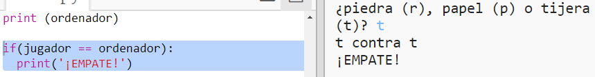
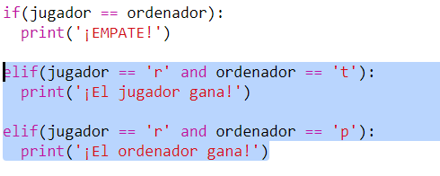
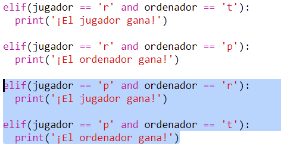
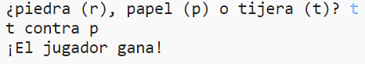

## Comprueba el resultado

Ahora añadamos el código para ver quién ha ganado.

+ Debes comparar las variables `jugador` y `ordenador` para ver quién ha ganado.
    
    Si son iguales, es un empate:
    
    

+ Pon a prueba tu código jugando al juego varias veces hasta que obtengas un empate.
    
    Necesitarás hacer clic en `Ejecutar` para comenzar una nueva partida.

+ Ahora veamos los casos en que el jugador eligió 'r' (piedra), pero el ordenador no.
    
    Si el ordenador eligió 's' (tijeras), entonces el jugador gana (la piedra gana a las tijeras).
    
    Si el ordenador eligió 'p' (papel), entonces el ordenador gana (el papel gana a la piedra).
    
    Podemos verificar la elección del jugador *y* la elección del ordenador usando `and`.
    
    

+ A continuación, veamos los casos en los que el jugador eligió 'p' (papel) pero el ordenador no:
    
    

+ Y, por último, ¿puedes añadir el código para elegir al ganador cuando el jugador elige 's' (tijeras) y el ordenador elige piedra o papel?

+ Ahora juega el juego para probar tu código.
    
    
    
    Haga clic en `Ejecutar` para comenzar una nueva partida.