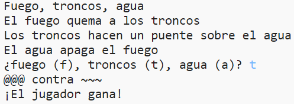

--- challenge ---

## Desafío: Crea un nuevo juego

¿Puedes crear tu propio juego al estilo de piedra, papel o tijeras, pero con diferentes objetos?

Haz clic en el botón "Duplicar" para hacer una copia de tu proyecto piedra, papel o tijeras, que te sirva como punto de partida.

Este ejemplo utiliza fuego, troncos y agua:

--- /challenge ---