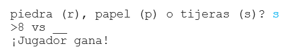

## Introducción

En este proyecto, harás un juego de Piedra, Papel o Tijeras y jugarás contra la computadora.

Reglas: Tú y la computadora escogerán piedra, papel o tijeras. El ganador se decidirá por estas reglas:

* La piedra rompe a las tijeras
* el papel cubre a la piedra
* Las tijeras cortan el papel

  <iframe src="https://trinket.io/embed/python/752572a400?outputOnly=true&start=result" width="600" height="500" frameborder="0" marginwidth="0" marginheight="0" allowfullscreen>
  </iframe>
  

### Información adicional para los líderes del club

Si necesitas imprimir este proyecto, por favor usa la [Versión para imprimir](https://projects.raspberrypi.org/es-LA/projects/rock-paper-scissors/print).

--- collapse ---
---
title: Notas para el líder del club
---

## Introducción:

En este proyecto, los niños aprenderán cómo hacer un programa que imite Piedra, Papel o Tijeras usando variables y enunciados condicionales.

## Recursos en línea

**Este proyecto usa Python 3.** Recomendamos usar [Trinket](https://trinket.io/) para escribir en Python online. Este proyecto contiene los siguientes Trinkets:

* [‘Rock, Paper, Scissors’ Resources -- jumpto.cc/rps-go](http://jumpto.cc/rps-go)

También hay un Trinket que contiene el proyecto completo:

* [‘Rock, Paper, Scissors’ Finished -- trinket.io/python/752572a400](https://trinket.io/python/752572a400)

## Recursos sin conexión

Si prefiere, este proyecto se puede [completar sin conexión](https://www.codeclubprojects.org/en-GB/resources/python-working-offline/). Puedes acceder a los recursos del proyecto haciendo click en el enlace 'Materiales del proyecto' para este proyecto. Este enlace contiene una sección de 'Recursos del proyecto', que incluye los recursos que los niños necesitarán para completar este proyecto offline. Asegúrate que cada niño tenga acceso a una copia de estos recursos. Esta sección incluye los siguientes archivos:

* rock-paper-scissors/rock-paper-scissors.py

También puedes encontrar una versión completa de este proyecto en la sección 'Recursos para Voluntarios', que contiene:

* rock-paper-scissors-finished/rock-paper-scissors.py

(Todos los recursos anteriores también se pueden descargar como archivos `.zip` de proyectos y voluntarios.)

## Objetivos del Aprendizaje

* Variables;
* Selección (`if`, `elif`, `else`); 
* Booleanos `==` and `and`.

Este proyecto incluye elementos de los siguientes aspectos del [Raspberry Pi Digital Making Curriculum](http://rpf.io/curriculum):

* [Usar estructuras de programación básicas para crear programas simples.](https://www.raspberrypi.org/curriculum/programming/creator)

## Desafíos

* 'Arte ASCII': Utiliza la lógica condicional para mostrar Arte ASCII para Piedra, Papel y Tijeras. 
* "Crear un nuevo juego" - Duplica el juego Piedra, Papel o Tijeras y modifícalo para crear un nuevo juego. 

--- /collapse ---

--- collapse ---
---
title: Materiales del proyecto
---

## Recursos del proyecto

* [archivo .zip que contiene todos los recursos del proyecto](resources/rock-paper-scissors-project-resources.zip)
* [Trinket en línea contiene todos los recursos del proyecto "Piedra, Papel oTijeras"](http://jumpto.cc/rps-go)
* [rock-paper-scissors/rock-paper-scissors.py](resources/rock-paper-scissors-rock-paper-scissors.py)

## Recursos del líder del club

* [archivo .zip que contiene todos los recursos del proyecto](resources/rock-paper-scissors-volunteer-resources.zip)
* [Proyecto Trinket completado en línea](https://trinket.io/python/752572a400)
* [rock-paper-scissors-finished/rock-paper-scissors.py](resources/rock-paper-scissors-finished-rock-paper-scissors.py)

--- /collapse ---