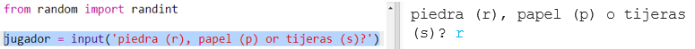
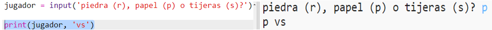

## Turno del jugador

Primero, deja que el jugador escoja Piedra, Papel o Tijera.

+ Abre este trinket: <a href="http://jumpto.cc/rps-go" target="_blank">jumpto.cc/rps-go</a>.

+ El proyecto ya contiene el código para importar las funciones que vas a usar en este proyecto.
    
    
    
    Más adelante, vas a usar `randint` para generar números aleatorios.

+ Primero, deja que el jugador elija Piedra, Papel o Tijeras escribiendo la letra 'r', 'p' o 's'.
    
    

+ Ahora imprime lo que eligió el jugador:
    
    

+ Prueba tu código haciendo click `Run`. Click en la ventana de salida del trinket e introduce tu elección.