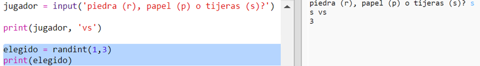
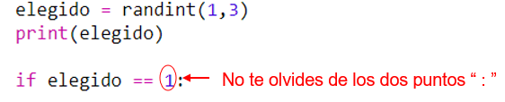
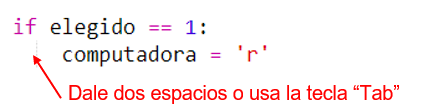
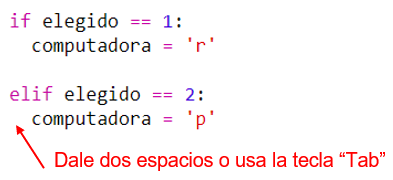
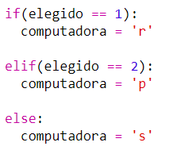
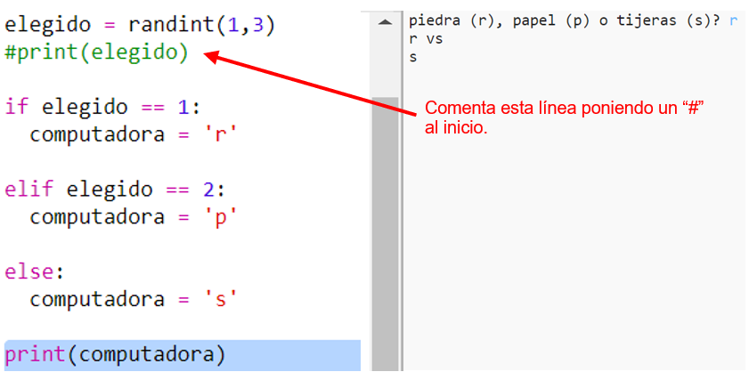
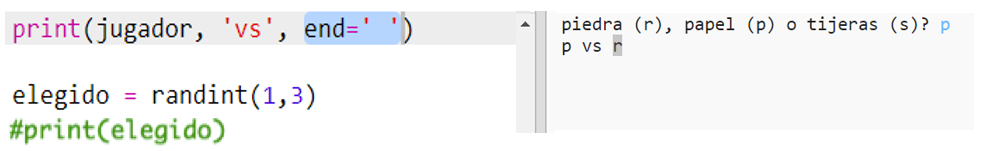

## Turno de la computadora

Ahora es el turno de la computadora. Puedes usar la función `randint` para generar un número aleatorio para decidir entre piedra, papel o tijeras.

+ Usa `randint` para generar un número aleatorio para decidir si la computadora ha elegido piedra, papel o tijeras.
    
    

+ Ejecuta tu programa muchas veces (deberás ingresar 'r', 'p' o 's' cada vez.)
    
    Verás que la 'elección' está configurada aleatoriamente en 1, 2 o 3.

+ Digamos que:
    
    + 1= piedra (r)
    + 2= papel (p)
    + 3= tijeras (s)
    
    Usa `if` para verificar si el número elegido es `1` (`==` es usado para ver si 2 cosas son iguales).
    
    

+ Python usa **indentation** (mover el código a la derecha) para mostrar que código está adentro del `if`. Puedes usar dos espacios (pulsa la barra espaciadora dos veces) o pulsa la **tecla tab** (generalmente encima de Bloq Mayus en el teclado.)
    
    Configura `computadora` to 'r' adentro de `if` usando sangría:
    
    

+ Puedes añadir una verificación alternativa usando `elif` (abreviatura de *else if*):
    
    
    
    Esta condición solo será verificada si la primera condición falla (si la computadora no eligió `1`)

+ Y finalmente, si la computadora no eligió `1` or `2` entonces, debe haber elegido `3`.
    
    Esta vez puedes usar `else` que significa "de otra manera".
    
    

+ Ahora, en lugar de imprimir el número aleatorio que eligió la computadora, puedes imprimir la letra.
    
    
    
    Puedes, o bien eliminar la línea `print (elegido)`, o hacer que el ordenador la ignore añadiendo `#` al principio de la línea.

+ Prueba tu código haciendo clic en Ejecutar y eligiendo tu opción.

+ Hmm, la elección del ordenador se imprime en una nueva línea. Puedes arreglar eso añadiendo `end = ' '` después de `contra`, que le dice a Python que termine con un espacio en lugar de hacerlo con una nueva línea.
    
    

+ Juega el juego varias veces haciendo clic en Ejecutar y tomando una decisión.
    
    Por ahora tendrás que averiguar quién te ha ganado. Luego añadirás el código de Python para resolverlo.