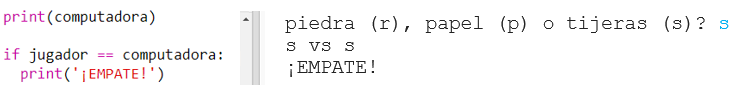
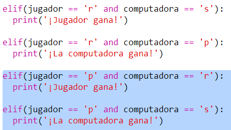

## Verifica el resultado

Ahora, añadiremos el código para ver quién ganó.

+ Necesitas comparar las variables `jugador` y `computadora` para ver quién ganó.
    
    Si son iguales, es un empate:
    
    

+ Pon a prueba tu código jugando al juego varias veces hasta que obtengas un empate.
    
    Necesitarás hacer clic en `Run` para comenzar una nueva partida.

+ Ahora, veamos los casos donde el jugador eligió 'r' (piedra) pero la computadora no.
    
    Si la computadora eligió 's' (tijeras) entonces el jugador gana (piedra vence a tijeras).
    
    Si la computadora escogió 'p' (papel) entonces la computadora gana (papel vence a piedra).
    
    Podemos verificar la elección del jugador *y* la elección de la computadora usando `y`.
    
    

+ A continuación, veamos los casos en los que el jugador eligió 'p' (papel) pero la computadora no:
    
    

+ Y, por último, ¿puedes añadir el código para elegir al ganador cuando el jugador elige 's' (tijeras) y la computadora elige piedra o papel?

+ Ahora juega para probar tu código.
    
    
    
    Click `Run` para empezar una nueva partida,.