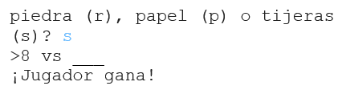
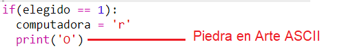
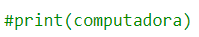
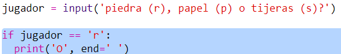

--- challenge ---

## Desafío: Arte ASCII

En lugar de usar las letras r, p y t para representar piedra, papel y tijera, ¿puedes usar el arte ASCII?

Por ejemplo:

Donde:

    piedra:  O
    papel: ___
    tijeras: >8
    

+ En lugar de decir `print computadora` deberás añadir una nueva línea a cada una de las opciones en `if` para imprimir el arte ASCII correcto. 

Hints:

+ En lugar de decir `print jugador` deberás añadir una línea if para verificar qué opción eligió el jugador e imprimir el arte ASCII correcto:

Hint:

Recuerda que añadir `end = ' '` al final de la línea `print` hace que termine con un espacio en lugar de terminar con una nueva línea.

--- /challenge ---