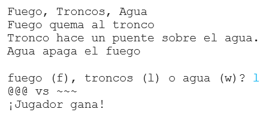

\--- challenge \---

## Desafío: Crea un nuevo juego

¿Puedes crear tu propio juego al estilo de Piedra, Papel o Tijeras, pero con diferentes objetos?

Haz clic en el botón "Duplicar" para hacer una copia de tu proyecto Piedra, Papel o Tijeras, para que te sirva como punto de partida.

Este ejemplo utiliza Fuego, Troncos y Agua:

\--- /challenge \---