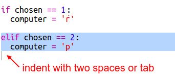
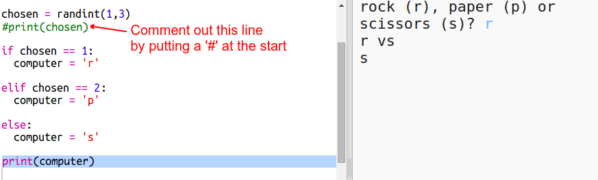

## Tietokoneen kääntyminen

Nyt se on tietokoneen käännös. Voit käyttää `randint` -toimintoa saadaksesi satunnaisen numeron päättää kallion, paperin ja saksin välillä.

+ Käytä `randint` tuottaa satunnaisluku päättää, onko tietokone valinnut kalliota, paperia tai saksiä.
    
    

+ Suorita käsikirjoituksesi monta kertaa (sinun on kirjoitettava r-kirjain, p-tai s-kerralla.)
    
    Sinun pitäisi nähdä, että "valittu" on satunnaisesti asetettu joko 1, 2 tai 3.

+ Sanokaamme:
    
    + 1 = kallio (r)
    + 2 = paperi (p)
    + 3 = sakset
    
    Käytä `jos` tarkistaa, onko valittu numero `1` (`==` käytetään nähdäksesi, onko 2 asiaa sama).
    
    

+ Python käyttää **sisennystä** (siirtääksesi koodin oikealle) osoittaakseen, mikä koodi on ``sisällä. Voit joko käyttää kahta tilaa (napauta välilyöntiä kahdesti) tai napauttaa **välilehteä** (tavallisesti näppäimistön CAPSLOCK yläpuolella).
    
    Aseta `tietokone` r: ksi `: n sisään` : n sisään sisennyksellä:
    
    

+ Voit lisätä vaihtoehtoisen tarkistuksen käyttämällä `elif` (lyhyt *muulle jos*):
    
    
    
    Tämä ehto tarkistetaan vain, jos ensimmäinen ehto epäonnistuu (jos tietokone ei ole valinnut `1`)

+ Ja lopuksi, jos tietokone ei valinnut `1` tai `2` se on valinnut `3`.
    
    Tällä kertaa voimme vain käyttää `muuta` mikä tarkoittaa muuten.
    
    

+ Nyt, sen sijaan, että tulostettaisiin satunnaisluku, jonka tietokone valitsi, voit tulostaa kirjeen.
    
    
    
    Voit joko poistaa linjan `tulostuksen (valittu)`tai tehdä tietokoneen ohittaa sen lisäämällä `#` rivin alkuun.

+ Testaa koodi napsauttamalla Suorita ja valitsemalla vaihtoehto.

+ Hmm, tietokone valitaan painettavaksi uudelle riville. Voit korjata tämän lisäämällä `loppu = ''` jälkeen `vs`, joka kertoo Pythonin lopettamaan tilan uuden linjan sijaan.
    
    

+ Pelaa peliä muutamalla kerralla valitsemalla Suorita ja tekemällä valinnan.
    
    Nyt sinun täytyy selvittää, kuka voitti itse. Seuraavaksi lisätään Python-koodi, jotta tämä voidaan ratkaista.