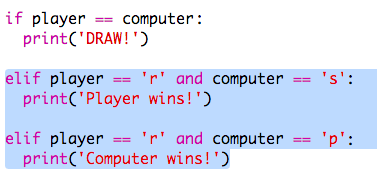

## Tarkista tulos

Lisää nyt koodi nähdäksesi kuka voitti.

+ Sinun on verrattava `soittimen` ja `tietokoneen` muuttujaa nähdäksesi kuka voitti.
    
    Jos he ovat samat, niin se on tasapeli:
    
    

+ Testaa koodisi pelaamalla peliä muutama kerta, kunnes saat piirustuksen.
    
    Sinun on napsautettava `Suorita` aloittaaksesi uuden pelin.

+ Katsotaan nyt tapauksia, joissa pelaaja valitsi 'r' (rock), mutta tietokone ei.
    
    Jos tietokone on valinnut sakset, pelaaja voittaa (rock beats sakset).
    
    Jos tietokone valitsi p: n (paperi), tietokone voittaa (paperin lyö kallio).
    
    Voimme tarkistaa soittimen valinta *ja* tietokoneen valinnalla `ja`.
    
    

+ Seuraavaksi tarkastellaan tapauksia, joissa pelaaja valitsi 'p' (paperi), mutta tietokone ei
    
    

+ Ja lopuksi, voitko lisätä koodin tarkistaa voittaja, kun pelaaja valitsi 's' (sakset) ja tietokone valitsi rockin tai paperin?

+ Nyt pelata peliä testataksesi koodia.
    
    
    
    Aloita uusi peli valitsemalla `Suorita`.