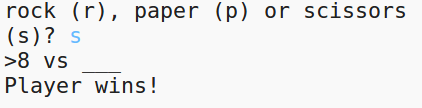

\--- haaste \---

## Haaste: ASCII Art

Voitko käyttää ASCII-taidetta sen sijaan, että käytit kiviä, paperia ja saksien kirjaimia r, p ja s?

Esimerkiksi:

Missä:

    rock: O
    paperi: ___
    sakset: >8
    

+ Sen sijaan, että sanoit `tulostus tietokoneesta` sinun on lisättävä uusi rivi jokaiseen `tai` n vaihtoehtoon, jotta oikea ASCII-taide voidaan tulostaa. 

vinkkejä:

+ Sen sijaan, että sanoit `tulostustyökalun` sinun on lisättävä uusi if -lauseke tarkistaaksesi, mihin kohtaan pelaaja valitsi ja tulosta oikean ASCII-taidon:

Vihje:

Muista, että lisäämällä `loppu = ''` `tuloksen` loppuun tekee sen päättymällä uudella rivillä sijaan.

\--- /haaste \---