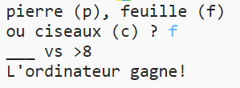

## Introduction

Dans ce projet, tu vas créer un jeu de Pierre, Feuille, Ciseaux et jouer contre un ordinateur.

Règles: l'ordinateur et toi allez choisir entre pierre, feuille ou ciseaux. Le gagnant est désigné selon ces règles:

* La pierre brise les ciseaux
* La feuille recouvre la pierre
* Les ciseaux coupent la feuille

  <iframe src="https://trinket.io/embed/python/e1e1d873be?outputOnly=true&start=result" width="600" height="500" frameborder="0" marginwidth="0" marginheight="0" allowfullscreen>
  </iframe>
  

### Informations complémentaires pour les responsables de club

Si tu as besoin d'imprimer ce projet, merci d'utiliser la [Version imprimable](https://projects.raspberrypi.org/en/projects/rock-paper-scissors/print).

## \--- collapse \---

## title: Notes pour le responsable de club

## Introduction :

Dans ce projet, les enfants apprendront comment faire un programme qui joue au Pierre, Feuille, Ciseaux en utilisant des variables et des instructions conditionnelles.

## Ressources en ligne

**Ce projet utilise Python 3.** Nous recommandons l'utilisation de [Trinket](https://trinket.io/) pour écrire du code Python en ligne. Ce projet contient les Trinkets suivants :

* [Ressources « Pierre, Feuille, Ciseaux » -- jumpto.cc/rps-go](http://jumpto.cc/rps-go)

Il existe aussi ce trinket qui contient le projet terminé :

* [« Pierre, Feuille, Ciseaux » terminé -- trinket.io/python/e1e1d873be](https://trinket.io/python/e1e1d873be)

## Ressources hors-ligne

Ce projet peut être [terminé hors-ligne](https://www.codeclubprojects.org/en-GB/resources/python-working-offline/) si désiré. Vous pouvez accéder aux ressources du projet en cliquant sur le lien « Matériaux du projet ». Ce lien contient une section « Ressources du projet » qui inclut les ressources dont les enfants auront besoin pour terminer le projet hors-ligne. Assurez-vous que les enfants ont accès à une copie de ces ressources. Cette section inclut les fichiers suivants :

* rock-paper-scissors/rock-paper-scissors.py

Vous pouvez aussi trouver une version complétée du projet dans la section « Ressources du bénévole » qui contient :

* rock-paper-scissors-finished/rock-paper-scissors.py

(Toutes les ressources ci-dessus peuvent aussi être téléchargées dans les fichiers`.zip` projet et bénévole)

## Objectifs d'apprentissage

* Variables;
* Sélection (`if`, `elif`, `else`); 
* Booléen `==` et `and` .

Ce projet couvre les élements suivants du [Programme Raspberry Pi de Créativité Numérique](http://rpf.io/curriculum) :

* [Utiliser les constructs basiques de programmation pour élaborer un programme simple.](https://www.raspberrypi.org/curriculum/programming/creator)

## Défis

* "Art ASCII" - Utiliser la logique conditionnelle pour afficher de l'art ASCII pour la pierre, la feuille et les ciseaux. 
* "Créer un nouveau jeu" - Dupliquer le jeu du Pierre, Feuille, Ciseaux et le remixer pour créer un nouveau jeu. 

\--- /collapse \---

## \--- collapse \---

## title: Matériel pour projet

## Ressources du projet

* [Fichier .zip contenant toutes les ressources du projet](resources/rock-paper-scissors-project-resources.zip)
* [Trinket en-ligne contenant des ressources du projet "Pierre, Feuille, Ciseaux"](http://jumpto.cc/rps-go)
* [rock-paper-scissors/rock-paper-scissors.py](resources/rock-paper-scissors-rock-paper-scissors.py)

## Ressources pour le responsable de club

* [Fichier .zip contenant toutes les ressources du projet](resources/rock-paper-scissors-volunteer-resources.zip)
* [Trinket Python en-ligne vierge](https://trinket.io/python/e1e1d873be)
* [rock-paper-scissors-finished/rock-paper-scissors.py](resources/rock-paper-scissors-finished-rock-paper-scissors.py)

\--- /collapse \---