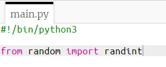
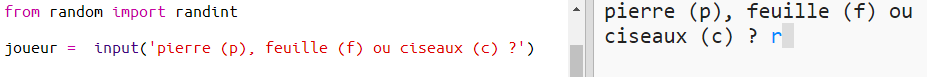
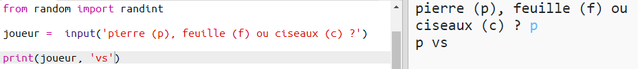

## Le tour du joueur

Tout d'abord, laissons le joueur choisir entre Pierre, Feuille ou Ciseaux.

+ Ouvre ce trinket: <a href="http://jumpto.cc/rps-go" target="_blank">jumpto.cc/rps-go</a>.

+ Le projet contient déjà le code pour importer une fonction que tu vas utiliser dans ce projet.
    
    
    
    Tu utiliseras plus tard la fonction `randint` pour générer des nombres aléatoires.

+ Laissons le joueur choisir Pierre, Feuille ou Ciseaux en tapant "p", "f", "c".
    
    

+ Maintenant affiche ce que le joueur a choisi:
    
    

+ Teste maintenant ton code en cliquant sur `Run`. Clique dans la fenêtre de sortie du Trinket et entre ton choix.