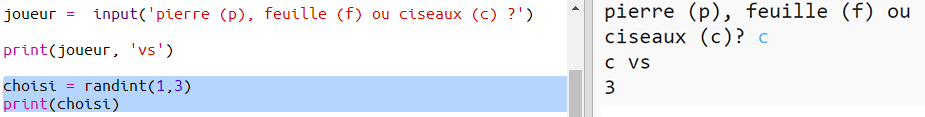

## Le tour de l'ordinateur

Maintenant c'est le tour de l'ordinateur. Tu peux utiliser la fonction `randint` pour générer un chiffre aléatoire pour décider entre pierre, feuille ou ciseaux.

+ Utilise `randint` pour générer un chiffre aléatoire pour décider si l'ordinateur a choisi pierre, feuille ou ciseaux.

  

+ Lance ton script plusieurs fois (tu auras besoin d'entrer 'r', 'p' ou 's' chaque fois.)

  Tu devrais voir que 'chosen' devient de façon aléatoire soit 1, 2 ou 3.

+ Disons :

  + 1 = rock (r)
  + 2 = paper (p)
  + 3 = scissors (s)

  Utilise `if` pour vérifier si le chiffre choisi est `1` (`==` est utilisé pour voir si 2 choses sont équivalentes.

  

+ Python se sert __d'indentation__ (en décalant le code vers la droite) afin d'identifier le code qui est à l'intérieur de la structure `if`. Tu peux utiliser soit 2 espaces (en tapant la barre d'espace deux fois) soit en appuyant sur la __touche de Tab(ulation)__ (habituellement se trouvant au-dessus de Verr Maj sur le clavier.)

  Paramétrer `computer` à 'r' à l'intérieur de la structure `if` avec de l'indentation :

  

+ Tu peux ajouter une vérification alternative utilisant `elif` (abrégé de _else if_ - "sinon si"):

  

  Cette condition sera vérifié seulement si la première condition n'est pas remplie (si l'ordinateur n'a pas choisi `1`)

+ Et enfin, si l'ordinateur n'a choisi ni `1` ni `2` ça veut dire qu'il a choisi `3`.

  Cette fois-ci nous pouvons simplement utiliser `else` qui veut dire "sinon".

  

+ Maintenant, au lieu d'afficher le chiffre aléatoire que l'ordinateur utilise tu vas pouvoir afficher la lettre.

   

   Tu peux soit supprimer la ligne `print(chosen)`, ou faire ignorer la ligne en le transformant en commentaire un symbole `#` en  début de ligne.

+ Teste ton code en cliquant sur Run et en choisiant ton option.

+ Hmm, le choix de l'ordinateur est affiché sur une nouvelle ligne. Tu pourrais corriger cela en ajoutant `end=' '` après `vs`, ce qui dit à Python de terminer la ligne avec un espace au lieu d'un saut de ligne.

   

+ Joue le jeu à quelques reprises en cliquand sur Run et en faisant votre choix.

  Pour l'instant tu vas devoir chercher qui a gagné toi-même. La prochaine étape sera d'utiliser du code Python pour ce faire.
