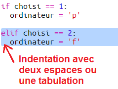

## Le tour de l'ordinateur

Maintenant c'est au tour de l'ordinateur. Tu peux utiliser la fonction `randint` pour générer un nombre aléatoire pour choisir entre pierre, feuille et ciseaux.

+ Utilise `randint`pour générer un nombre aléatoire et choisir si l'ordinateur a choisi Pierre, Feuille ou ciseaux.
    
    

+ Éxécute plusieurs fois le script (tu devras entrer plusieurs fois "p", "f" ou "c" à chaque fois.)
    
    Tu devrais voir que "choisi" est défini aléatoirement sur 1, 2 ou 3.

+ Disons:
    
    + 1= pierre (p)
    + 2= feuille (f)
    + 3= ciseaux (c)
    
    Utilise `if` pour vérifier que le nombre choisi est `1` (`==` est utilisé pour voir si deux choses sont identiques).
    
    

+ Python utilise **l'indentation** (bouger le code à droite) pour montrer quel code est à l’intérieur de l'instruction `if`. Tu peux à la fois utiliser deux espaces (tapes deux fois sur la barre d'espace) ou taper sur la **touche tabulation** (généralement au dessus de la touche VERR MAJ sur le clavier.)
    
    Paramètre `ordinateur` sur "p" à l'intérieur de l'instruction `if` en utilisant l'indentation:
    
    

+ Tu peux ajouter une autre vérification en utilisant `elif` (abréviation de *else if* , sinon si):
    
    
    
    Cette condition ne sera seulement vérifiée que si la première condition échoue (si l'ordinateur ne choisi pas `1`)

+ Et enfin, si l'ordinateur ne choisi pas `1` ou `2` alors il doit avoir choisi `3`.
    
    Cette fois nous pouvons juste utiliser `else` qui signifie autrement.
    
    

+ Maintenant, à la place d'afficher le nombre aléatoire que l'ordinateur choisi tu peux imprimer la lettre.
    
    
    
    Tu peux soit supprimer la ligne `print(choisi)`, ou faire en sorte que l'ordinateur l'ignore en ajoutant un `#` au début de la ligne.

+ Teste ton code en cliquant sur Run et en choisissant tes options.

+ Hmm, le choix de l'ordinateur est imprimé sur une nouvelle ligne. Tu peux choisir de corriger cela en ajoutant `end=' '` après `vs`, qui va dire à Python de finir avec un espace au lieu d'une nouvelle ligne.
    
    

+ Joue au jeu quelques fois en cliquant sur Run et en faisant un choix.
    
    Pour l'instant tu devras déterminer toi-même qui a gagné. Ensuite tu ajouteras du code Python pour résoudre ce problème.