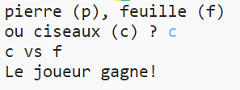

## Vérifier le résultat

Maintenant, ajoutons le code pour voir qui a gagné.

+ Tu devras comparer les variables `joueur` et `ordinateur` pour voir qui a gagné.
    
    S'ils sont identiques, alors on procède à un tirage au sort:
    
    

+ Teste ton code en jouant plusieurs fois le jeu jusqu'à obtenir un tirage au sort.
    
    Tu devras cliquer plusieurs fois sur `Run` pour lancer un nouveau jeu.

+ Maintenant regardons les cas où le joueur a choisi "p" (Pierre) mais pas l'ordinateur.
    
    Si l'ordinateur choisi "c" (ciseaux) alors le joueur gagne (la pierre bat les ciseaux).
    
    Si l'ordinateur choisi "f" (feuille) alors l'ordinateur gagne (le papier bat la pierre).
    
    Nous pouvons vérifier le choix du joueur *et* le choix de l'ordinateur en utilisant `et`.
    
    

+ Ensuite regardons les cas où le joueur a choisi "f" (feuille) mais pas l'ordinateur:
    
    

+ Et enfin tu peux ajouter le code pour déterminer le gagnant quand le joueur choisi "c" (ciseaux) et l'ordinateur choisi pierre ou feuille?

+ Maintenant joue au jeux pour vérifier ton code.
    
    
    
    Clique sur `Run` pour lancer un nouveau jeu.