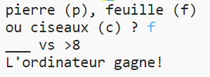
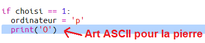
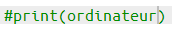
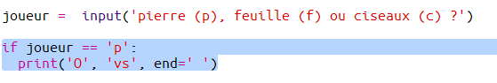

\--- challenge \---

## Défi : L'art ASCII

Au lieu d'utiliser les lettres p, f et c pour représenter pierre, feuille et ciseaux, peux-tu utiliser l'art ASCII ?

Par exemple :

Où :

    pierre: O
    feuille: ___
    ciseaux: >8
    

+ Au lieu de dire `print (ordinateur)` tu devras ajouter une nouvelle ligne pour chaque option dans le `if` pour afficher le bon art ASCII. 

Astuces :

+ Au lieu de dire `print (joueur)` tu devras ajouter une nouvelle instruction conditionnelle if pour vérifier quel issue le joueur a choisi et afficher le bon art ASCII :

Indice :

Rappelle-toi qu'en ajoutant `end=' '` à la fin des paramètres de la fonction `print` la fera se terminer par un espace à la place d'une nouvelle ligne.

+ Include a line to print `vs` between the player and computer results.

    print('vs', end=' ')
    

\--- /challenge \---